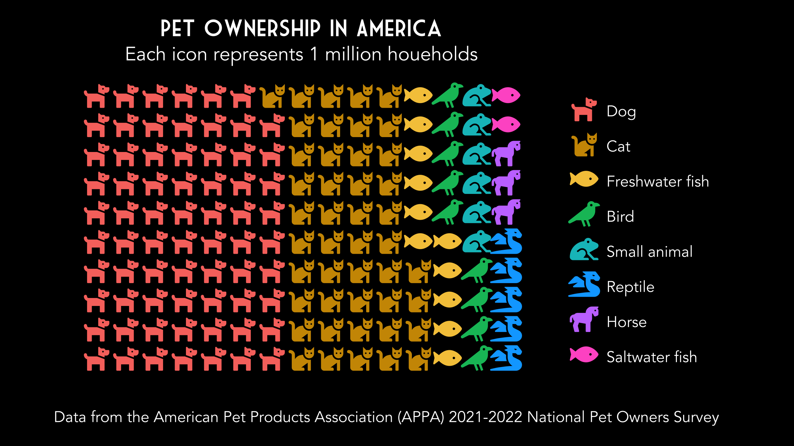

# (PART) Comparisons {-}

# Part-to-whole

```{r}
library(treemap)
library(faux)
library(tidyverse)
```

I've been wanting to get more familiar with treemap plots. 

## Simulate data

I always like to start my exploration with simulated data. The mixed design simulation functions below are from [faux](https://debruine.github.io/faux/articles/sim_mixed.html).

Make a school with 5 grades, 1-4 classes per grade, and 15-35 students per class. Get some random names from the 2010 Scottish babies.

```{r pth-data-sim}
set.seed(8675309) # for reproducible data simulation

school <- add_random(grade = 5) %>%
  add_random(class = sample(1:4, nrow(.), TRUE), 
             .nested_in = "grade") %>%
  add_random(student = sample(15:35, nrow(.), TRUE), 
             .nested_in = "class") %>%
  mutate(name = sample(size = nrow(.),
                       x = ukbabynames::scotbabynames %>%
                         filter(year == 2010) %>%
                         pull(name)))

head(school)
```

## Basic Treemap

The basic version is OK, but I think we can do better here.

```{r pth-treemap-basic}
school %>% 
  count(grade, class) %>%
  treemap(
    index = c("grade", "class"), 
    vSize = "n"
  )
```

## Adjust Labels

First, I'll adjust the label size and alignment. I adapted this code from a book that Emily Nordmann and I recently wrote: [Applied Data Skills](https://psyteachr.github.io/ads-v1/custom.html#treemap). For `fontsize.labels` and `align.labels`, I added vector names to help me remember which is which, but the names aren't used by `treemap()` at all, just the order.

The class labels aligned to the bottom right are too close to the edges, so give them some padding with `xmod.labels` and `ymod.labels`. I'm also going to remove the transparent grey label background with `bg.labels = 0`

```{r pth-treemap-labels}
school %>% 
  count(grade, class) %>%
  treemap(
    index = c("grade", "class"), 
    vSize = "n", 
    title = "",
    # set different label sizes for each type of label
    fontsize.labels = c(grade = 30, class = 15), 
    # remove shaded background
    bg.labels = 0,
    # set different alignments for two label types
    align.labels = list(
      grade = c("left", "top"), 
      class = c("right", "bottom")
    ),
    xmod.labels = c(0, -.1), # nudge class labels left
    ymod.labels = c(0, .1)   # nudge class labels up
  )
```

## Colour scheme

I'd like to use the #30DayChartChallenge theme colours for my plots, so let's set that up. I'm going to name the colours after the chapter they represent.

```{r pth-dcc-colours}
dcc_theme <- list(
  comp = "#4864DB", # ~royalblue
  dist = "#10D4CF", # ~darkturquoise
  rels = "#8DEA74", # ~lightgreen
  time = "#F5C748", # ~tan1
  cert = "#EA4E11"  # ~orangered2
)
```

```{r pth-treemap-colours}
school %>% 
  count(grade, class) %>%
  treemap(
    index = c("grade", "class"), 
    vSize = "n", 
    title = "",
    palette = dcc_theme,
    fontsize.labels = c(grade = 30, class = 10), 
    bg.labels = 0,
    align.labels = list(
      grade = c("left", "top"), 
      class = c("center", "center")
    ),
    xmod.labels = c(0, -.1),
    ymod.labels = c(0, .1)
  )
```

## Change text

Now I want to upgrade the labels. It's probably easiest to do this in the data using `mutate()`. I'll set them to the kind of primary school grade labels we use in Scotland, where each grade is P1, P2, ... and each class within a grade gets a letter suffix. 

```{r school2}
school2 <- school %>% 
  count(grade, class) %>%
  mutate(grade = gsub("grade", "P", grade)) %>%
  group_by(grade) %>%
  mutate(class = paste0(grade, letters[1:n()])) %>%
  ungroup() %>%
  mutate(class = paste0(class, "\nn = ", n))
```

Finally, make the borders thicker. It's starting to look like a Mondrian!.

```{r pth-treemap-final, fig.cap = "Treemap plot of classes nested in grades (P1 to P5). There are 2-4 classes in each grade with 16-35 students. The size of each box represents the size of the class, and the colour of the box represents the grade."}
school2 %>%
  treemap(
    index = c("grade", "class"), 
    vSize = "n", 
    title = "",
    palette = dcc_theme,
    fontcolor.labels = "white",
    fontsize.labels = c(grade = 30, class = 15), 
    bg.labels = 0,
    align.labels = list(
      grade = c("left", "top"), 
      class = c("right", "bottom")
    ),
    xmod.labels = c(0, -.1),
    ymod.labels = c(0, .1),
    border.lwds = 5, # thicker borders
  )
```


# Pictogram

I recently discovered the `r pkg("waffle", "https://github.com/hrbrmstr/waffle/")` package for making waffle plots. Emily and I refuse to teach students on our [Applied Data Skills](https://psyteachr.github.io/ads-v1/) course how to make pie charts, and these are a sweet alternative. 

```{r}
#devtools::install_github("hrbrmstr/waffle")
library(tidyverse)
library(waffle)
```


## Pictogram data

Pictograms are generally used for counts, and pets are my go-to example for unordered categorical data (even though ferrets are obviously the best).

I found a table of [pet ownership in the USA](https://www.iii.org/fact-statistic/facts-statistics-pet-ownership-and-insurance). They had an excel file download option for the data, but the file was corrupted, so I used `r pkg("datapasta")` to copy it below.

```{r pictogram-data}
# Number of U.S. Households That Own a Pet, by Type of Animal 
us_pets <- tibble::tribble(
               ~Pet, ~Number,
              "Dog",      69,
              "Cat",    45.3,
  "Freshwater fish",    11.8,
             "Bird",     9.9,
     "Small animal",     6.2,
          "Reptile",     5.7,
            "Horse",     3.5,
   "Saltwater fish",     2.9
  ) %>%
  mutate(Pet = factor(Pet, Pet))
```

## Icons

Then I need to find matching free icons at [fontawesome](https://fontawesome.com/v5/search?q=animal&m=free&s=solid). Make sure you're searching the v5 icons; v6 icons won't work and will result in an impenetrable error-message from `scale_label_pictogram()`.

```{r, eval = FALSE}
icons <- c("dog", "cat", "fish-fins", "crow", "frog", "dragon", "horse", "fish")
ggplot(us_pets, aes(label = Pet, values = Number)) +
  geom_pictogram() +
  scale_label_pictogram(values = icons)
```

<pre><code>## Error in vapply(if (n &gt; length(values)) rep(values[[1]], n) else values, : values must be length 1,
##  but FUN(X[[8]]) result is length 0</code></pre>

Yes, I know I used fish twice, and not many people owned winged dragons, but they were the only reptile!

```{r pictogram-icons}
icons <- c("dog", "cat", "fish", "crow", "frog", "dragon", "horse", "fish")
ggplot(us_pets, aes(label = Pet, values = Number)) +
  geom_pictogram() +
  scale_label_pictogram(values = icons)
```

## Colour

Now, let's add some colour. I'm also going to make the icon size a little smaller.

```{r pictogram-colour}
ggplot(us_pets, aes(label = Pet, values = Number, color = Pet)) +
  geom_pictogram(size = 6.5) +
  scale_label_pictogram(values = icons)
```

I like the ggplot default colours, except for the green fish. I'd rather it be yellow. I found this function to re-create the [ggplot default colour scheme](https://stackoverflow.com/questions/8197559/emulate-ggplot2-default-color-palette).

```{r pictogram-show-col}
ggplotColours <- function(n, h = c(0, 360) + 15){
  h[2] <- h[2] - 360/n
  hcl(h = (seq(h[1], h[2], length = n)), c = 100, l = 65)
}
pet_colours <- ggplotColours(8)
pet_colours[3] <- "#F5C748"
```


```{r pictogram-custom-colour}
ggplot(us_pets, aes(label = Pet, values = Number, color = Pet)) +
  geom_pictogram(size = 6.5) +
  scale_label_pictogram(values = icons) +
  scale_colour_manual(values = pet_colours)
```


## Clean it up

Make sure the coordinates are equal to not stretch out the aspect ratio of the icons, add `theme_enhance_waffle()` to get rid of extraneous background, and add labels to aid interpretation and for the data provenance.

```{r pictogram-clean}
plot <- ggplot(us_pets, aes(label = Pet, values = Number, color = Pet)) +
  geom_pictogram(size = 6.5) +
  scale_label_pictogram(values = icons) +
  scale_colour_manual(values = pet_colours) +
  coord_equal() +
  theme_enhance_waffle() +
  labs(title = "Pet Ownership in America",
       subtitle = "Each icon represents 1 million houeholds",
       caption = "Data from the American Pet Products Association (APPA) 2021-2022 National Pet Owners Survey")

plot
```

## Customise

Finally, use `theme()` to really customise the look. I adjusted the spacing between the items on the legend with `legend.spacing.y`, which requires the guides to be set `byrow` to work. 

```{r pictogram-final, fig.cap = "Number of US households (in millions) with each of 8 common pet types. Data from the American Pet Products Association (APPA) 2021-2022 National Pet Owners Survey."}
plot +
  theme(axis.ticks = element_blank(),
        plot.background = element_rect(fill = "black", color = "black"),
        plot.margin = unit(c(.5, .5, .5, .0), 'cm'),
        plot.title = element_text(family = "Market Deco", hjust = 0.5),
        plot.subtitle = element_text(hjust = 0.5),
        plot.caption.position = "plot",
        panel.background = element_rect(fill = "black", color = "black"),
        legend.background = element_blank(),
        legend.title = element_blank(),
        legend.key = element_blank(),
        legend.spacing.y = unit(.25, 'cm'),
        text = element_text(family = "Avenir", color = "white")) +
  ## important additional element
  guides(color = guide_legend(byrow = TRUE),
         label = guide_legend(byrow = TRUE))
```

However, I'm having trouble saving the plot using `ggsave()`. The icons end up garbled.

```{r}
ggsave("images/day2.png", width = 8, height = 5)

```


# Historical

# Flora

# Slope

# OWID (data)
