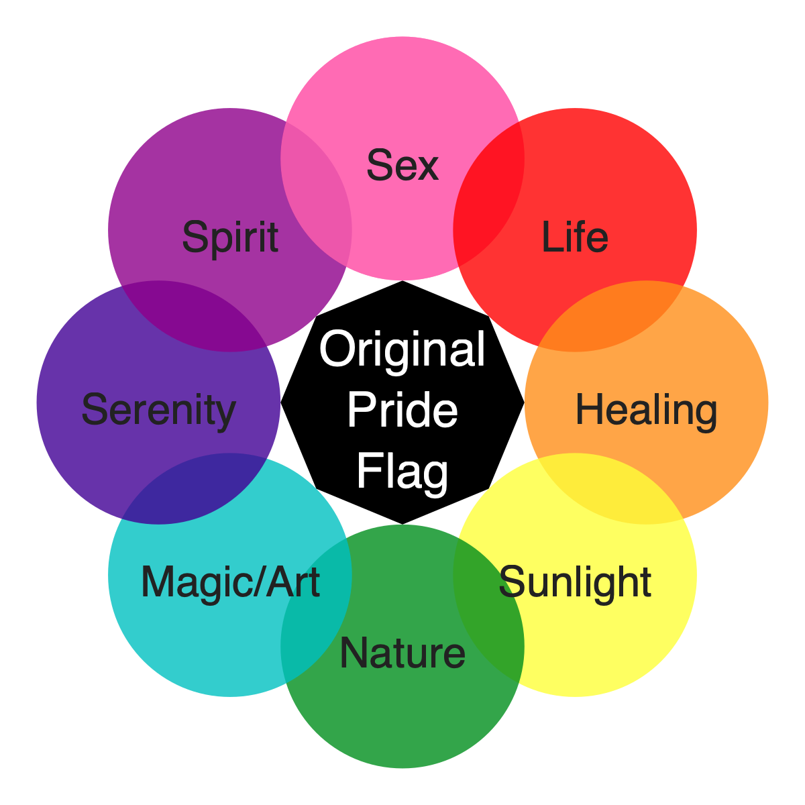
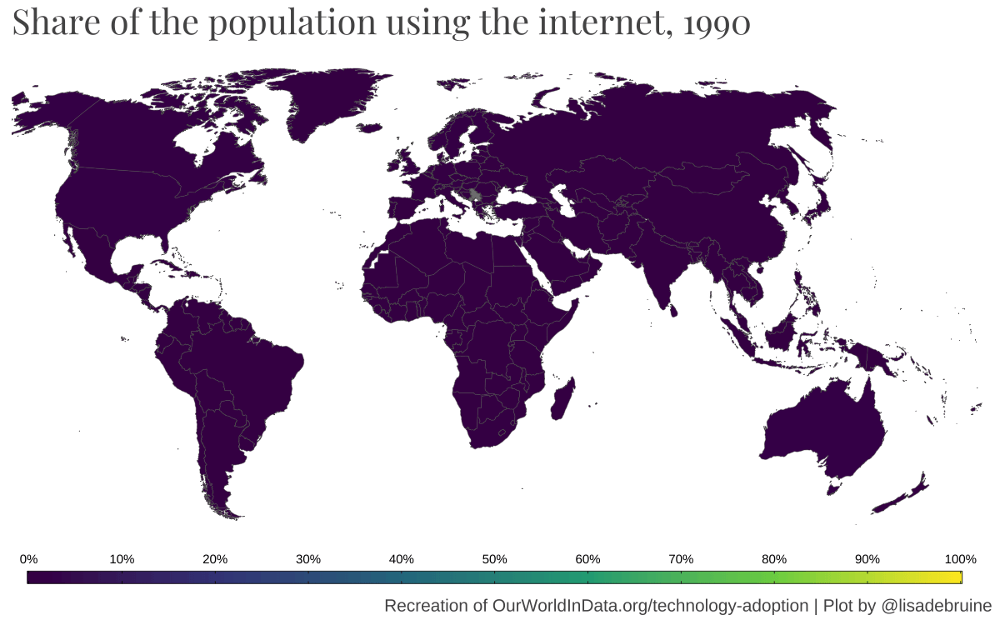

# (PART) Comparisons {-}

# Part-to-whole

```{r, message=FALSE}
library(treemap)
library(faux)
library(tidyverse)
```

I've been wanting to get more familiar with treemap plots. 

## Simulate data

I always like to start my exploration with simulated data. The mixed design simulation functions below are from [faux](https://debruine.github.io/faux/articles/sim_mixed.html).

Make a school with 5 grades, 1-4 classes per grade, and 15-35 students per class.

```{r pth-data-sim}
set.seed(8675309) # for reproducible data simulation

school <- add_random(grade = 5) %>%
  add_random(class = sample(1:4, nrow(.), TRUE), 
             .nested_in = "grade") %>%
  add_random(student = sample(15:35, nrow(.), TRUE), 
             .nested_in = "class")

head(school)
```

## Basic Treemap

The basic version is OK, but I think we can do better here.

```{r pth-treemap-basic}
school %>% 
  count(grade, class) %>%
  treemap(
    index = c("grade", "class"), 
    vSize = "n"
  )
```

## Adjust Labels

First, I'll adjust the label size and alignment. I adapted this code from a book that Emily Nordmann and I recently wrote: [Applied Data Skills](https://psyteachr.github.io/ads-v1/custom.html#treemap). For `fontsize.labels` and `align.labels`, I added vector names to help me remember which is which, but the names aren't used by `treemap()` at all, just the order.

The class labels aligned to the bottom right are too close to the edges, so give them some padding with `xmod.labels` and `ymod.labels`. I'm also going to remove the transparent grey label background with `bg.labels = 0`

```{r pth-treemap-labels}
school %>% 
  count(grade, class) %>%
  treemap(
    index = c("grade", "class"), 
    vSize = "n", 
    title = "",
    # set different label sizes for each type of label
    fontsize.labels = c(grade = 30, class = 15), 
    # remove shaded background
    bg.labels = 0,
    # set different alignments for two label types
    align.labels = list(
      grade = c("left", "top"), 
      class = c("right", "bottom")
    ),
    xmod.labels = c(0, -.1), # nudge class labels left
    ymod.labels = c(0, .1)   # nudge class labels up
  )
```

## Colour scheme

I'd like to use the #30DayChartChallenge theme colours for my plots, so let's set that up. I'm going to name the colours after the chapter they represent.

```{r pth-dcc-colours}
dcc_theme <- list(
  comp = "#4864DB", # ~royalblue
  dist = "#10D4CF", # ~darkturquoise
  rels = "#8DEA74", # ~lightgreen
  time = "#F5C748", # ~tan1
  cert = "#EA4E11"  # ~orangered2
)
```

```{r pth-treemap-colours}
school %>% 
  count(grade, class) %>%
  treemap(
    index = c("grade", "class"), 
    vSize = "n", 
    title = "",
    palette = dcc_theme,
    fontsize.labels = c(grade = 30, class = 10), 
    bg.labels = 0,
    align.labels = list(
      grade = c("left", "top"), 
      class = c("center", "center")
    ),
    xmod.labels = c(0, -.1),
    ymod.labels = c(0, .1)
  )
```

## Change text

Now I want to upgrade the labels. It's probably easiest to do this in the data using `mutate()`. I'll set them to the kind of primary school grade labels we use in Scotland, where each grade is P1, P2, ... and each class within a grade gets a letter suffix. 

```{r school2}
school2 <- school %>% 
  count(grade, class) %>%
  mutate(grade = gsub("grade", "P", grade)) %>%
  group_by(grade) %>%
  mutate(class = paste0(grade, letters[1:n()])) %>%
  ungroup() %>%
  mutate(class = paste0(class, "\nn = ", n))
```

Finally, make the borders thicker. It's starting to look like a Mondrian!.

```{r pth-treemap-final, fig.cap = "Treemap plot of classes nested in grades (P1 to P5). There are 2-4 classes in each grade with 16-35 students. The size of each box represents the size of the class, and the colour of the box represents the grade."}
day1_plot <- school2 %>%
  treemap(
    index = c("grade", "class"), 
    vSize = "n", 
    title = "",
    palette = dcc_theme,
    fontcolor.labels = "white",
    fontsize.labels = c(grade = 30, class = 15), 
    bg.labels = 0,
    align.labels = list(
      grade = c("left", "top"), 
      class = c("right", "bottom")
    ),
    xmod.labels = c(0, -.1),
    ymod.labels = c(0, .1),
    border.lwds = 5 # thicker borders
  )
```

## Saving a treemap

I tried `ggsave()` first and it took a *really* long time to save, and then the resulting image was blank. I should remember that not everything is ggplot; the output of the `treemap()` function is a list that draws a plot as a side effect (unless you set `draw = FALSE`), so you have to use base R plot saving techniques.

I couldn't figure out how to re-plot from the `day1_plot` object, so just had to retype the plot. This didn't work well in an Rmd code chunk (I think treemap can sense if it's in a code chunk with inline plot rendering and overrides the dev), so I had to run it in the console. 

```{r pth-treemap-save, eval = FALSE}
# open the png file
ragg::agg_png("images/day1.png", 
              width = 8, height = 4.5, 
              background = "transparent",
              units = "in", res = 150)

# plot the treemap
school2 %>%
  treemap(
    index = c("grade", "class"), 
    vSize = "n", 
    title = "",
    palette = dcc_theme,
    fontcolor.labels = "white",
    fontsize.labels = c(grade = 30, class = 15), 
    bg.labels = 0,
    align.labels = list(
      grade = c("left", "top"), 
      class = c("right", "bottom")
    ),
    xmod.labels = c(0, -.1),
    ymod.labels = c(0, .1),
    border.lwds = 5 # thicker borders
  )

# close the png file
while (!is.null(dev.list())) dev.off()
 
```

# Pictogram

I recently discovered the `r pkg("waffle", "https://github.com/hrbrmstr/waffle/")` package for making waffle plots. Emily and I refuse to teach students on our [Applied Data Skills](https://psyteachr.github.io/ads-v1/) course how to make pie charts, and these are a sweet alternative. 

```{r, message=FALSE}
#devtools::install_github("hrbrmstr/waffle")
library(tidyverse)  # for data wrangling
library(waffle)     # for pictograms
library(showtext)   # for fonts
```

## Fonts

I'm never sure what I'm doing with fonts, but this procedure seems to work to install the FontAwesome fonts that you need for pictograms and also any other specialist fonts you'd like.

```{r}
waffle::install_fa_fonts()
fontdir <- "/Library/Frameworks/R.framework/Versions/4.1/Resources/library/waffle/fonts/"
font_add(family = waffle::fa5_brand,
         regular = paste0(fontdir, "fa-brands-400.ttf"))
font_add(family = waffle::fa5_solid,
         regular = paste0(fontdir, "fa-solid-900.ttf"))
font_add(family = "Avenir",
         regular = "/System/Library/Fonts/Avenir.ttc")
font_add(family = "Market Deco",
         regular = "~/Library/Fonts/Market_Deco.ttf")
showtext_auto()
```


## Pictogram data

Pictograms are generally used for counts, and pets are my go-to example for unordered categorical data (even though ferrets are obviously the best).

I found a table of [pet ownership in the USA](https://www.iii.org/fact-statistic/facts-statistics-pet-ownership-and-insurance). They had an excel file download option for the data, but the file was corrupted, so I used `r pkg("datapasta")` to copy it below.

```{r pictogram-data}
# Number of U.S. Households That Own a Pet, by Type of Animal 
us_pets <- tibble::tribble(
               ~Pet, ~Number,
              "Dog",      69,
              "Cat",    45.3,
  "Freshwater fish",    11.8,
             "Bird",     9.9,
     "Small animal",     6.2,
          "Reptile",     5.7,
            "Horse",     3.5,
   "Saltwater fish",     2.9
  ) %>%
  mutate(Pet = factor(Pet, Pet)) # keep this order
```

## Icons

Then I need to find matching free icons at [fontawesome](https://fontawesome.com/v5/search?q=animal&m=free&s=solid). 

Make sure you're searching the v5 icons; v6 icons won't work and will result in an impenetrable error-message from `scale_label_pictogram()`.

```{r, eval = FALSE}
icons <- c("dog", "cat", "fish-fins", "crow", "frog", "dragon", "horse", "fish")
ggplot(us_pets, aes(label = Pet, values = Number)) +
  geom_pictogram() +
  scale_label_pictogram(values = icons)
```

<pre><code>## Error in vapply(if (n &gt; length(values)) rep(values[[1]], n) else values, : values must be length 1,
##  but FUN(X[[8]]) result is length 0</code></pre>

Yes, I know I used fish twice, and not many people owned winged dragons, but they were the only reptile!

```{r pictogram-icons}
icons <- c("dog", "cat", "fish", "crow", "frog", "dragon", "horse", "fish")
ggplot(us_pets, aes(label = Pet, values = Number)) +
  geom_pictogram() +
  scale_label_pictogram(values = icons)
```

## Colour

Now, let's add some colour. I'm also going to make the icon size a little smaller.

```{r pictogram-colour}
ggplot(us_pets, aes(label = Pet, values = Number, color = Pet)) +
  geom_pictogram(size = 6.5) +
  scale_label_pictogram(values = icons)
```

I like the ggplot default colours, except for the green fish. I'd rather it be yellow. I found this function to re-create the [ggplot default colour scheme](https://stackoverflow.com/questions/8197559/emulate-ggplot2-default-color-palette).

```{r pictogram-show-col}
ggplotColours <- function(n, h = c(0, 360) + 15){
  h[2] <- h[2] - 360/n
  hcl(h = (seq(h[1], h[2], length = n)), c = 100, l = 65)
}
pet_colours <- ggplotColours(8)
pet_colours[3] <- "#F5C748"
```


```{r pictogram-custom-colour}
ggplot(us_pets, aes(label = Pet, values = Number, color = Pet)) +
  geom_pictogram(size = 6.5) +
  scale_label_pictogram(values = icons) +
  scale_colour_manual(values = pet_colours)
```


## Clean it up

Add `coord_equal()` to make sure the horizontal and vertical spacing are the same. Add `theme_enhance_waffle()` to get rid of extraneous background, and add labels to aid interpretation and for the data provenance.

```{r pictogram-clean}
ggplot(us_pets, aes(label = Pet, values = Number, color = Pet)) +
  geom_pictogram(size = 6.5) +
  scale_label_pictogram(values = icons) +
  scale_colour_manual(values = pet_colours) +
  coord_equal() +
  theme_enhance_waffle() +
  labs(title = "Pet Ownership in America",
       subtitle = "Each icon represents 1 million houeholds",
       caption = "Data from the American Pet Products Association (APPA) 2021-2022 National Pet Owners Survey")
```

## Customise

Finally, use `theme()` to really customise the look. I adjusted the spacing between the items on the legend with `legend.spacing.y`, which requires the guides to be set `byrow` to work. 

```{r pictogram-final, fig.cap = "Number of US households (in millions) with each of 8 common pet types.", fig.alt="Number of US households (in millions) with each of 8 common pet types.  Data from the American Pet Products Association (APPA) 2021-2022 National Pet Owners Survey. Dog=69, Cat=45.3, Freshwater fish=11.8, Bird=9.9, Small animal=6.2, Reptile=5.7, Horse=3.5, Saltwater fish=2.9", cache=FALSE}

ggplot(us_pets, aes(label = Pet, values = Number, color = Pet)) +
  geom_pictogram(size = 6.5) +
  scale_label_pictogram(values = icons) +
  scale_colour_manual(values = pet_colours) +
  coord_equal() +
  theme_enhance_waffle() +
  labs(title = "Pet Ownership in America",
       subtitle = "Each icon represents 1 million houeholds",
       caption = "Data from the American Pet Products Association (APPA) 2021-2022 National Pet Owners Survey") +
  theme(axis.ticks = element_blank(),
        plot.background = element_rect(fill = "black", color = "black"),
        plot.margin = unit(c(.5, .5, .5, .0), 'cm'),
        plot.title = element_text(family = "Market Deco", hjust = 0.5),
        plot.subtitle = element_text(hjust = 0.5),
        plot.caption.position = "plot",
        panel.background = element_rect(fill = "black", color = "transparent"),
        legend.background = element_blank(),
        legend.title = element_blank(),
        legend.key = element_blank(),
        legend.text = element_text(vjust = 1),
        legend.spacing.y = unit(.25, 'cm'),
        text = element_text(family = "Avenir", color = "white")) +
  ## required to make legend.spacing.y work
  guides(color = guide_legend(byrow = TRUE),
         label = guide_legend(byrow = TRUE))
```

## Save Pictogram

However, I had trouble saving the plot using `ggsave()`. The icons ended up all question marks. I eventually fixed that by doing something with the fonts (maybe adding them with `r pkg("showtext")`?), but the icons are still tiny, and the font is blurry at a dpi that makes the icons look right.

```{r pictogram-garbled, fig.alt="Same as above, but all the icons are tiny."}
ggsave("images/day2_garbled.png", width = 8, height = 4.5, units = "in")
knitr::include_graphics("images/day2_garbled.png") 
```

This turns out to be because `ggsave()` uses ragg by default (HT [Steve Haroz](https://twitter.com/sharoz/status/1510342578268516355)), which isn't playing well with fontawesome icons, so I have to set the device back to `png`.

```{r pictogram-png, fig.alt="fixed"}
ggsave("images/day2.png", width = 8, height = 4.5, device = png)
 
```


# Historical

```{r hist-setup, message=FALSE}
library(tidyverse)
library(showtext)

font_add(family = "Market Deco",
         regular = "~/Library/Fonts/Market_Deco.ttf")
font_add(family = "Avenir",
         regular = "/System/Library/Fonts/Avenir.ttc")
showtext_auto()
```


## Population Data

I got this dataset from [Our World in Data](https://ourworldindata.org/population-sources).

```{r hist-data}
pop <- read_csv("data/population-past-future.csv",
                show_col_types = FALSE)

spec(pop)
```

The column names need some cleaning (I prefer to work with column names that are all lowercase with no spaces), and I don't need some of the data.

```{r hist-data-clean}
pop <- read_csv("data/population-past-future.csv",
                col_names = c("region", "year", "population"),
                skip = 1,
                col_types = "c-id")

head(pop)
```


## Select relevant data

I just want to plot the population for the 6 major world regions, so I'll filter that and make a quick line plot to see what I've got.

```{r hist-world-regions}
world_regions <- pop %>%
  filter(region %in% c("Africa", "Asia", "Europe", "Oceania", "North America", "South America"))
```

```{r hist-plot1}
ggplot(world_regions, aes(x = year, y = population, color = region)) +
  geom_line()
```

## Transform y-axis

The population growth is pretty exponential at the end, so a log transformation of the y-axis might help.

```{r hist-log}
ggplot(world_regions, aes(x = year, y = population, color = region)) +
  geom_line() +
  scale_y_log10()
```

## Region order

It would make more sense if the legend was in the same order as the lines, so I'll turn that column into a factor ordered by the population at the latest year.

```{r hist-region-order}
region_order <- world_regions %>%
  filter(year == max(year)) %>%
  arrange(desc(population)) %>%
  pull(region)

world_regions <- world_regions %>%
  mutate(region = factor(region, region_order))
```

I'll also add a point for each year with data.

```{r hist-order}
ggplot(world_regions, aes(x = year, y = population, color = region)) +
  geom_line() +
  geom_point() +
  scale_y_log10()
```


## Variable x-axis

The data collection isn't even at all. The years go every 1000 from -10000 to 0, then every 100 from 0 to 1700, then every 10 from 1700 to 1800, then every year from 1800 to 2021.

```{r hist-years}
unique(world_regions$year) %>% sort() %>% `[`(1:50)
```

I tried a few x-axis transformations, and they're not straightforward because the x-axis crosses 0, which most transformations can't handle. This was one of the silliest.

```{r hist-log-x}
ggplot(world_regions, aes(x = year, y = population, color = region)) +
  geom_line() +
  geom_point() +
  scale_y_log10() +
  scale_x_continuous(trans = "reciprocal")
```


So I'll add a new column that specifies which time period they're in. I'll replace this text later, so it's probably easiest to give them alphabetic labels now.

```{r hist-time-period}
world_regions <- world_regions %>%
  mutate(time_period = case_when(
      year < 0 ~ "A",
      year < 1700 ~ "B",
      year < 1800 ~ "C",
      year < 2022 ~ "D"))
```


```{r hist-facet}
ggplot(world_regions, aes(x = year, y = population, color = region)) +
  geom_line() +
  geom_point() +
  scale_y_log10() +
  facet_grid(~time_period, scales = "free_x")
  
```


## Clean Up

Now we're getting somewhere, but still need to clean this up a lot. I'm going to remove the panel spacing and expansion so the plots touch each other. I'll also customise the breaks and labels for the y-axis to make that easier to understand, and customise the colours (I do love a rainbow).

```{r hist-cleaner}
# custom colours
rainbow <- c("#983E82","#E2A458","#F5DC70","#59935B","#467AAC","#61589C")

ggplot(world_regions, aes(x = year, y = population, color = region)) +
  geom_line() +
  geom_point() +
  facet_grid(~time_period, scales = "free_x") +
  scale_x_continuous(name = NULL,
                     expand = expansion(0)) +
  scale_y_log10(name = "Population (log scale)",
                breaks = 10^(5:10),
                labels = c("100K", "1M", "10M", "100M", "1B", "10B"),
                limit = c(1e5, 1e10)) +
  scale_color_manual(name = NULL,
                     values = rainbow) +
  theme_bw() +
  theme(axis.title.x = element_blank(),
        axis.text.x = element_text(angle = 90, hjust = 1),
        panel.spacing.x = unit(0, "cm"))
```

However, the borders of each time period don't meet. I can fix that by duplicating the border years and assigning them to the previous time period. 

```{r hist-add-border-years}
borders <- world_regions %>%
  group_by(time_period) %>%
  filter(year == min(year)) %>%
  ungroup() %>%
  filter(time_period != "A") %>%
  mutate(time_period = recode(time_period, B = "A", C = "B", D = "C"))

world_regions2 <- bind_rows(world_regions, borders)
```

Let's also fix the facet labels. The function `as_labeller()` lets you translate between the data labels and custom labels for facets. And set some custom colours and custom x-axis breaks and labels. I moved the legend inside the plot to give the plot more horizontal room.

```{r hist-custom}
# custom facet labels
tp_labels <- c(
  A = "10000BC to 0",
  B = "0 to 1700",
  C = "1700 to 1800",
  D = "1800 to 2021"
)

# custom x-axis breaks and labels
x_breaks <- c(seq(-10000, -2000, 2000),
              seq(0, 1600, 200),
              seq(1700, 1790, 10),
              seq(1800, 2021, 20))

x_labels <- c(paste(seq(10000, 2000, -2000), "BCE"),
              seq(0, 1700, 200),
              seq(1700, 1790, 10),
              seq(1800, 2021, 20))

ggplot(world_regions2, aes(x = year, y = population, color = region)) +
  geom_line() +
  geom_point() +
  facet_grid(~time_period, 
             scales = "free_x", 
             labeller = as_labeller(tp_labels)) +
  scale_x_continuous(name = NULL,
                   breaks = x_breaks,
                   labels = x_labels,
                   expand = expansion(0)) +
  scale_y_log10(name = "Population (log scale)",
                breaks = 10^(5:10),
                labels = c("100K", "1M", "10M", "100M", "1B", "10B"),
                limit = c(1e5, 1e10)) +
  scale_color_manual(name = NULL,
                     values = rainbow) +
  theme_bw() +
  theme(axis.text.x = element_text(angle = 90, hjust = 1),
        panel.spacing.x = unit(0, "cm"),
        legend.background = element_rect(fill = "transparent"),
        legend.position = c(.1, .75) )
```


## Change time periods

I changed by mind about 1700 to 1800. This plot gives it too much prominence. so I'll combine it with 1800+. It looked weird to specify "BCE" only for the years before 0, so I added "CE" (Common Era) to the years after 0 and adjusted the angle and number of labels to make it easier to read.

```{r}
# recode time period to 3 periods (merge C and D)
world_regions3 <- world_regions2 %>%
  mutate(time_period = recode(time_period, A = "A", B = "B", C = "C", D = "C"))

# remake facet labels
tp_labels <- c(
  A = "10000 BCE to 0",
  B = "0 to 1700 CE",
  C = "1700 CE to 2021 CE"
)

# remake x-axis breaks and labels
x_breaks <- c(seq(-10000, -2000, 2000),
              seq(0, 1500, 300),
              seq(1700, 2021, 50))

x_labels <- c(paste(seq(10000, 2000, -2000), "BCE"),
              paste(seq(0, 1500, 300), "CE"),
              paste(seq(1700, 2021, 50), "CE"))
```


```{r hist-3-time-periods}
ggplot(world_regions3, aes(x = year, y = population, color = region)) +
  geom_line() +
  geom_point(size = 1, alpha = 0.5) +
  facet_grid(~time_period, 
             scales = "free_x", 
             labeller = as_labeller(tp_labels)) +
  scale_x_continuous(name = NULL,
                   breaks = x_breaks,
                   labels = x_labels,
                   expand = expansion(0)) +
  scale_y_log10(name = "Population (log scale)",
                breaks = 10^(5:10),
                labels = c("100K", "1M", "10M", "100M", "1B", "10B"),
                limit = c(1e5, 1e10)) +
  scale_color_manual(name = NULL,
                     values = rainbow) +
  labs(title = "World Population (Historical Estimates)",
       caption = "Data from Our World in Data | Plot by @lisadebruine") +
  theme_bw() +
  theme(text = element_text(family = "Avenir"),
        axis.text.x = element_text(angle = 30, hjust = 1),
        panel.spacing.x = unit(0, "cm"),
        legend.background = element_rect(fill = "transparent"),
        legend.position = c(.1, .75),
        panel.grid.minor = element_blank(),
        plot.title = element_text(family = "Market Deco"))
```

```{r hist-png, include = FALSE, eval = FALSE}
ggsave("images/day3.png", width = 8, height = 4.5, device = png)
```


# Flora

```{r, message=FALSE}
library(tidyverse) # always useful
library(glue) # for editing SVG text
library(rsvg) # to convert SVG to other formats
```

I'm going a little off-piste today. I was inspired by all of these [stock infographics](https://www.vectorstock.com/royalty-free-vectors/chart-flower-infographic-options-vectors), but I wondered if I could make something similar with code. You probably can do this with ggplot and annotations, but I wanted to try something different.

```{r flora-examples, fig.cap="Flower infographics from vectorstock.com"}
knitr::include_graphics("images/flower_infographics.png")
```


## SVG

I have some experience making SVGs (scalable vector graphics), but I always have to look things up. [W3Schools](https://www.w3schools.com/graphics/svg_intro.asp) is my favourite source for quick tutorials on web stuff. I used it a ton to make this chart.

While I was developing this code, I needed to have a quick look at the images a lot, and couldn't figure out an efficient way to view SVGs, so I wrote a function that converts the svg text to a PNG tempfile and displays it in my Rmd, but only when I'm running the code interactively. 

```{r}
viewsvg <- function(svg, width = 5, height = 5, dpi = 150) {
  if (interactive() &&
      !isTRUE(getOption("knitr.in.progress"))) {
    imgpath <- tempfile(fileext = ".png")
    rsvg::rsvg_png(svg = charToRaw(svg),
                   file = imgpath,
                   width = width*dpi, height = height*dpi)
    knitr::include_graphics(imgpath)
  } else {
    cat(svg)
  }
}
```

It outputs the SVG as html when knitting. All of the images below are created with a code chunk that looks like this:

```{r, eval = FALSE, verbatim="r, results='asis', echo = FALSE"}
viewsvg(svg)
```


## Flower Petals

First, I need a function to figure out the coordinates of regular polygons. 

```{r}
poly_coords <- function(n = 6, r = 1, cx = 0, cy = 0, rot = 0, digits = 2) {
  x = map_dbl(0:(n-1), ~{ cx + r * cos(2 * pi * .x / n + rot) })
  y = map_dbl(0:(n-1), ~{ cy + r * sin(2 * pi * .x / n + rot) })
  
  list(
    x = round(x, digits),
    y = round(y, digits)
  )
}

# example hexagon
poly_coords(n = 6)
```

Now, make `n` circles with radius `r` that are `petal_dist` away from the center of the flower.

```{r}
n <- 6
r <- 200
petal_dist <- 300
cx <- 500
cy <- 500

coords <- poly_coords(n, petal_dist, cx, cy)
petals <- glue('    <circle cx="{coords$x}" cy="{coords$y}" r="{r}" fill="{rainbow(n)}" />') %>%
  paste(collapse = "\n")

svg <- paste("<svg viewBox = '0 0 {2*cx} {2*cy}'>",
        petals, 
      "</svg>",
      sep = "\n") %>%
  glue()
```


```{r flora-basic, results='asis', echo = FALSE}
viewsvg(svg)
```

## Rotate

Rotate them so the red is at 12:00.

```{r}
rot <- -pi/2

coords <- poly_coords(n, petal_dist, cx, cy, rot)
petals <- glue('    <circle cx="{coords$x}" cy="{coords$y}" r="{r}" fill="{rainbow(n)}" />') %>%
  paste(collapse = "\n")

svg <- paste("<svg viewBox = '0 0 {2*cx} {2*cy}'>",
        petals, 
      "</svg>",
      sep = "\n") %>%
  glue()
```


```{r flora-rotated, results='asis', echo = FALSE}
viewsvg(svg)
```


## Fix the Overlap

When they overlap, the last petal is on top of the first, so we need to replot the left half of that. It took me forever to figure out how to plot the left half of a circle with `<path>` :(

```{r}
coords <- poly_coords(n, petal_dist, cx, cy, rot)
petals <- glue('    <circle cx="{coords$x}" cy="{coords$y}" r="{r}" fill="{rainbow(n)}" />') %>%
  paste(collapse = "\n")

x1 <- coords$x[[1]]
y1 <- coords$y[[1]]
petal_fix <- glue('    <g transform="rotate({rot*180/pi}, {x1}, {y1})">
       <path d="M {x1-r} {y1}
       A {r} {r} 0 0 1 {x1+r} {y1}
       L {x1-r} {y1}
       Z" 
       fill="{rainbow(n)[[1]]}" /></g>')

svg <- paste("<svg viewBox = '0 0 {2*cx} {2*cy}'>",
        petals, petal_fix, 
      "</svg>",
      sep = "\n") %>%
  glue()
```


```{r, results='asis', echo = FALSE}
viewsvg(svg)
```


Now I want to add a center hexagon that just touches each petal.

```{r}
center <- poly_coords(n, petal_dist-r, cx, cy, rot) %>%
  glue("{cc$x},{cc$y}", cc = .) %>%
  paste(collapse = " ") %>%
  glue('<polygon points="{pts}" fill="grey" />', pts = .)

svg <- paste("<svg viewBox = '0 0 {2*cx} {2*cy}'>", 
      center,
      petals, petal_fix,
      "</svg>",
      sep = "\n") %>%
  glue()
```


```{r, results='asis', echo = FALSE}
viewsvg(svg)
```


## 7 Petals

```{r}
n          <- 7
rot        <- 8.5*pi/7
petal_dist <- 400
r          <- 200
cx         <- 1.1 * (petal_dist + r)
cy         <- cx

center <- poly_coords(n, petal_dist-r, cx, cy, rot) %>%
  glue("{cc$x},{cc$y}", cc = .) %>%
  paste(collapse = " ") %>%
  glue('<polygon points="{pts}" fill="grey" />', pts = .)

coords <- poly_coords(n, petal_dist, cx, cy, rot)
petals <- glue('    <circle cx="{coords$x}" cy="{coords$y}" r="{r}" fill="{rainbow(n)}" />') %>%
  paste(collapse = "\n")

x1 <- coords$x[[1]]
y1 <- coords$y[[1]]
petal_fix <- glue('    <g transform="rotate({rot*180/pi}, {x1}, {y1})">
       <path d="M {x1-r} {y1}
       A {r} {r} 0 0 1 {x1+r} {y1}
       L {x1-r} {y1}
       Z" 
       fill="{rainbow(n)[[1]]}" /></g>')


text <- glue('    <text x="{coords$x}" y="{coords$y+40}">{LETTERS[1:n]}</text>"') %>%
  paste(collapse = "\n")

svg_style <- '<style type="text/css">
svg { 
  font-family: sans-serif;
  font-size: 80px; 
  text-anchor: middle; 
  fill: white;
}
</style>'

svg <- paste("<svg viewBox = '0 0 {{2*cx}} {{2*cy}}'>", 
             svg_style,
             center,
             '<text x="{{cx}}" y="{{cy-20}}">All of the</text>',
             '<text x="{{cx}}" y="{{cy+90}}">Things</text>',
             petals, petal_fix, text, "</svg>",
             sep = "\n") %>%
  glue(.open = "{{", .close = "}}")

```


```{r, results='asis', echo = FALSE}
viewsvg(svg)
```

## Make a Function

Now I just need to wrap this all in a function so I can change the things I need. I also added transparency to the petals, which necessitated making the two halves of the first petal separately, otherwise the overlap fix increases the opacity of half the petal if there's any transparency. 

```{r}
poly_coords <- function(n = 6, r = 1, cx = 0, cy = 0, rot = 0, digits = 2) {
  x = map_dbl(0:(n-1), ~{ cx + r * cos(2 * pi * .x / n + rot) })
  y = map_dbl(0:(n-1), ~{ cy + r * sin(2 * pi * .x / n + rot) })
  
  list(
    x = round(x, digits),
    y = round(y, digits)
  )
}

flower <- function(n = 6, petal_dist = 500, r = 250, rot = -pi/2,
                   petal_text = LETTERS[1:n],
                   center_text = c("All of the", "Things"),
                   petal_text_size = r/2,
                   center_text_size = petal_dist/6,
                   center_text_offsets = c(-0.2, +0.9) * center_text_size,
                   petal_colors = rainbow(n),
                   petal_alpha = 1.0,
                   center_color = "#808080",
                   petal_text_color = "white",
                   center_text_color = petal_text_color) {
  
  # calculate centre
  cx <- 1.1 * (petal_dist + r)
  cy <- cx
  
  # make centre polygon
  center <- poly_coords(n, petal_dist-r, cx, cy, rot) %>%
    glue("{cc$x},{cc$y}", cc = .) %>%
    paste(collapse = " ") %>%
    glue('<polygon points="{pts}" fill="{center_color}" />', pts = .)
  
  # make center texts
  center_texts <- glue('    <text x="{cx}" y="{cy+center_text_offsets}" fill="{center_text_color}" font-size="{center_text_size}px">{center_text}</text>') %>%
    paste(collapse = "\n")
  
  # make petals
  coords <- poly_coords(n, petal_dist, cx, cy, rot)
  petals <- glue('    <circle cx="{coords$x}" cy="{coords$y}" r="{r}" fill="{petal_colors}" fill-opacity="{petal_alpha}" />') %>%
    paste(collapse = "\n")
  
  x1 <- coords$x[[1]]
  y1 <- coords$y[[1]]
  petal_fix1 <- glue('    <g transform="rotate({(rot+pi)*180/pi}, {x1}, {y1})">
         <path d="M {x1-r} {y1}
         A {r} {r} 0 0 1 {x1+r} {y1}
         L {x1-r} {y1}
         Z" 
         fill="{petal_colors[[1]]}" fill-opacity="{petal_alpha}" /></g>')
  
  petal_fix2 <- glue('    <g transform="rotate({rot*180/pi}, {x1}, {y1})">
         <path d="M {x1-r} {y1}
         A {r} {r} 0 0 1 {x1+r} {y1}
         L {x1-r} {y1}
         Z" 
         fill="{petal_colors[[1]]}" fill-opacity="{petal_alpha}" /></g>')
  
  # make petal text
  petals_text <- glue('    <text x="{coords$x}" y="{coords$y+petal_text_size/2}">{petal_text}</text>', .literal = TRUE) %>%
    paste(collapse = "\n")
  
  # general styles
  svg_style <- '<style type="text/css">
  svg { 
    font-family: sans-serif;
    font-size: {{petal_text_size}}px; 
    text-anchor: middle; 
    fill: {{petal_text_color}};
  }
</style>'
  
  svg <- paste("<svg viewBox = '0 0 {{2*cx}} {{2*cy}}'>", 
               svg_style,
               center, center_texts,
               petal_fix1, petals, petal_fix2, petals_text,
               "</svg>",
               sep = "\n") %>%
    glue(.open = "{{", .close = "}}")
  
  svg
}
```

Test the defaults.

```{r}
svg <- flower()
```


```{r, results='asis', echo = FALSE}
viewsvg(svg)
```

## Original Pride Flag

Test the customisability by making a chart with the meaning of the 8 colours of the original pride flag.

```{r}
svg <- flower(n = 8, petal_dist = 400, r = 200,
              petal_colors = c("#FF66B1", "#FF0000", "#FF8F1A", "#FEFF3A",
                               "#008F1D", "#00C0C0", "#420095", "#8F008B"),
              petal_alpha = 0.8,
              petal_text = c("Sex", "Life", "Healing", "Sunlight",
                             "Nature", "Magic/Art", "Serenity", "Spirit"),
              center_text = c("Original", "Pride", "Flag"),
              center_text_size = 80,
              center_text_offsets = c(-60, 40, 140),
              petal_text_color = "#222222",
              petal_text_size = 70,
              center_color = "black",
              center_text_color = "white"
)
```


```{r, results='asis', echo = FALSE}
viewsvg(svg)
```

## Save as SVG or PNG

You can display your SVG directly in a website by setting `results='asis'` in the code chunk header. It will display it full size unless you use another method to constrain the image size. I set a css style of `svg { width: 100%; }`.

```{r, results='asis'}
cat(svg)
```

You can write it to an svg file, or use svgr to convert to an image. 

```{r}
write(svg, "images/day4.svg")
rsvg::rsvg_png(svg = charToRaw(svg), 
               file = "images/day4.png", 
               width = 8*150, height = 8*150)


```


# Slope

I'm going back to data simulation. Someone asked me recently how to add a continuous predictor to a mixed effects model. I'm going to build a function for simulating data with a nested structure sampling people within countries and a continuous predictor of time (0-10). I'll plot the data with various values for the parameters, including random intercepts and *slopes*. If you need a refresher on mixed effects models, see [this tutorial by Dale Barr and me](https://debruine.github.io/lmem_sim/).

```{r, message=FALSE}
library(tidyverse)
library(faux)
theme_set(theme_bw())
set.seed(8675309)
```


## Data Simulation Function

First, I need to write a function to generate the simulated data. I want to be able to vary the fixed and random effects parameters, but am setting almost everything to 0 as a default. I'm using mixed design simulation functions from the faux package, which you can learn more about in this [vignette](https://debruine.github.io/faux/articles/sim_mixed.html). 

```{r}

sim <- function(
  n_countries = 10, # number of countries samples
  n_people = 10,    # number of people sampled per country
  c_int_sd = 0,     # SD of random intercept for countries
  c_time_sd = 0,    # SD of random slope for time (by country)
  c_cors = 0,       # correlation between c_int and c_time
  p_int_sd = 0,     # SD of random intercept for people
  p_time_sd = 0,    # SD of random slope for time (by person)
  p_cors = 0,       # correlations among p_int, p_time, p_height
  err_sd = 0,       # error SD
  intercept = 0,    # grand intercept
  b_time = 0        # fixed effect of time
){

add_random(country = LETTERS[1:n_countries]) %>%
  add_random(person = n_people, 
             .nested_in = "country") %>%
  add_ranef(.by = "country", 
            c_int = c_int_sd,
            c_time = c_time_sd,
            .cors = c_cors) %>%
  add_ranef(.by = "person", 
            p_int = p_int_sd, 
            p_time = p_time_sd, 
            .cors = p_cors) %>%
  crossing(time = 0:10) %>%
  add_ranef(err = err_sd) %>%
  mutate(dv = intercept + c_int + p_int + 
           (b_time + p_time + c_time) * time + 
           err)
}
  
```

## Default

The default plot is pretty boring. Everyone's score is is equal to the grand intercept.

```{r slope-default}
data <- sim()
ggplot(data, aes(x = time, y = dv, color = country)) +
  geom_smooth(method = lm, formula = y ~ x) +
  stat_summary(geom = "point", fun = mean)
```

## Random error

We can make the simulation more realistic by adding random error.

```{r slope-err}
data <- sim(err_sd = 1)
ggplot(data, aes(x = time, y = dv, color = country, group = person)) +
  geom_smooth(method = lm, formula = y ~ x, alpha = 0.1, show.legend = FALSE) +
  facet_wrap(~country, nrow = 2)
```

Here are the data for each person in country A.

```{r slope-err-person}
data %>%
  filter(country == "A") %>%
  ggplot(aes(x = time, y = dv, color = person)) +
  geom_smooth(method = lm, formula = y ~ x, alpha = 0.2, show.legend = FALSE) +
  stat_summary(geom = "point", fun = mean, show.legend = FALSE) +
  facet_wrap(~person, nrow = 2)
```

We're going to leave the error SD as a totally unrealistic 0 for the next few plots to make it easier to see what happens to the data when you're changing random effects parameters.

## Random intercepts for country

Now let's add a random intercept per country. Setting c_int_sd to 1 means that the intercepts for each country are simulated to vary with an SD of 1.

```{r slope-c-int}
data <- sim(c_int_sd = 1)
ggplot(data, aes(x = time, y = dv, color = country)) +
  geom_smooth(method = lm, formula = y ~ x) +
  stat_summary(geom = "point", fun = mean)
```

## Random slopes for country

What does it look like if we leave the random intercepts at 0 and set the random slope of time for countries to 1?

```{r slope-c-time}
data <- sim(c_time_sd = 1)
ggplot(data, aes(x = time, y = dv, color = country)) +
  geom_smooth(method = lm, formula = y ~ x) +
  stat_summary(geom = "point", fun = mean)
```

## Random intercepts and slopes for country

What if we set both the random intercept and slope of time for country to 1? Now, the intercepts vary around 0 and the slopes of the lines also vary.

```{r slope-c-int-time}
data <- sim(c_int_sd = 1, c_time_sd = 1)
ggplot(data, aes(x = time, y = dv, color = country)) +
  geom_smooth(method = lm, formula = y ~ x) +
  stat_summary(geom = "point", fun = mean)
```

Random intercepts and slopes can be correlated. For example, the time effect might be larger in countries where people tend to have lower scores, leading the random slope and intercept for country to be negatively correlated.

I increased the SD of the random intercept to make it easier to see that countries with a higher intercept tend to have more negative slopes than those with a lower intercept.

```{r slope-c-int-time-cor-neg}
data <- sim(c_int_sd = 5, c_time_sd = 1, c_cors = -0.5)
ggplot(data, aes(x = time, y = dv, color = country)) +
  geom_smooth(method = lm, formula = y ~ x) +
  stat_summary(geom = "point", fun = mean)
```
And here's the same plot with a positive correlation. Now the countries with a higher intercept tend to have a more positive effect of time. 

```{r slope-c-int-time-cor-pos}
data <- sim(c_int_sd = 5, c_time_sd = 1, c_cors = +0.5)
ggplot(data, aes(x = time, y = dv, color = country)) +
  geom_smooth(method = lm, formula = y ~ x) +
  stat_summary(geom = "point", fun = mean)
```

## Random intercepts for person

If we vary the random intercepts by person, this increases the variability within each country. Note that because we're only sampling 10 people in each country, this means the intercept for each country will vary a bit depending on the mean of the 10 people from that country.

```{r slope-p-int}
data <- sim(p_int_sd = 1)
ggplot(data, aes(x = time, y = dv, color = country)) +
  geom_smooth(method = lm, formula = y ~ x, alpha = 0.1)
```

Let's look at the data for each country separately.

```{r slope-p-int-country}
ggplot(data, aes(x = time, y = dv, color = country, group = person)) +
  geom_smooth(method = lm, size = 0.5, formula = y ~ x, show.legend = FALSE) +
  facet_wrap(~country, nrow = 2)
```


## Random slopes for person

Vary the random slopes by person. Here, we're viewing the data for each country separately. The thick lines are the average slope for the country.

```{r slope-p-time}
ggplot(data, aes(x = time, y = dv, color = country)) +
  geom_smooth(aes(group = person), size = .2, 
              method = lm, formula = y ~ x, 
              show.legend = FALSE) +
  geom_smooth(method = lm, size = 1.5, formula = y ~ x, show.legend = FALSE) +
  facet_wrap(~country, nrow = 2)
```

## Fixed effect of time

Let's add a fixed effect of time.

```{r slope-fixed}
data <- sim(b_time = 1)
ggplot(data, aes(x = time, y = dv, color = country)) +
  geom_smooth(method = lm, formula = y ~ x)
```

That's pretty boring, so lets also add random time slopes for both country and person. Make the fixed effect of time bigger to emphasise how the average slopes by country tend to be positive, even though there is a lot of variation in the slopes for individual people.

```{r slope-fixed-rand}
data <- sim(b_time = 2, c_time_sd = 1, p_time_sd = 1)
ggplot(data, aes(x = time, y = dv, color = country)) +
  geom_smooth(aes(group = person), size = .2, 
              method = lm, formula = y ~ x, 
              show.legend = FALSE) +
  geom_smooth(size = 1.5, method = lm, formula = y ~ x, 
              show.legend = FALSE) +
  facet_wrap(~country, nrow = 2)
```

## Realistic data

Finally, let's set all of the fixed and random effect parameters to non-zero values. 

```{r slope-realistic}
data <- sim(c_int_sd = 10, c_time_sd = 1, c_cors = 0.5,
            p_int_sd = 10, p_time_sd = 1, p_cors = 0.5, 
            err_sd = 5, intercept = 100, b_time = 2)

ggplot(data, aes(x = time, y = dv, color = country)) +
  geom_smooth(aes(group = person), size = .2, 
              method = lm, formula = y ~ x, 
              se = FALSE, show.legend = FALSE) +
  geom_smooth(size = 1.5, method = lm, formula = y ~ x, 
              alpha = 0.3, show.legend = FALSE) +
  facet_wrap(~country, nrow = 2) +
  scale_x_continuous(breaks = seq(0, 10, 2))
```

```{r, include = FALSE, eval = FALSE}
ggsave("images/day5.png", width = 8, height = 4.5, device = png)
```


# OWiD

```{r, message = FALSE}
library(tidyverse)     # for data wrangling and visualisation
library(sf)            # for maps
library(rnaturalearth) # for map coordinates
library(gganimate)     # for animated plots
library(transformr)    # for animated maps
library(gifski)        # for more efficient gif creation
library(ggthemes)      # for map theme
library(lwgeom)        # for map projection
library(showtext)      # for adding fonts

# add the playfair font for the plot title
font_add_google(name = "Playfair Display", family = "Playfair Display")
font_add(family = "Playfair Display",
         regular = "~/Library/Fonts/PlayfairDisplay-VariableFont_wght.ttf")
showtext_auto()
```

I hadn't ever really looked at [Our World in Data](https://ourworldindata.org/) in detail before. It's amazing! So much data and so many clever visualisations. I love the maps, so I thought I'd try to recreate the [share of individuals using the internet](https://ourworldindata.org/technology-adoption#share-of-population-with-internet-access).

```{r owid-original, echo = FALSE}
knitr::include_graphics("images/share-of-individuals-using-the-internet.png")
```


## Data

I hate working with columns that have uppercase letters or spaces in the names, so I adjusted the column names when importing. I also found out later that this dataset labels South Sudan as "SSD", but the data from sf labels it as "SDS", so I'll fix it here.

```{r}
# data from https://ourworldindata.org/technology-adoption
data_orig <- read_csv("data/share-of-individuals-using-the-internet.csv",
                      col_names = c("country", "code", "year", "it_net_users"),
                      skip = 1, show_col_types = FALSE) %>%
  mutate(code = recode(code, SSD = "SDS", .default = code))
```

There are a lot of missing years. I want them in the map explicitly as rows with it_net_users == NA, for reasons that will get clear later. Pivot wider, which will create a column for each year with NA as the value for any countries that don't have a row for that year, then pivot back longer. 

```{r}
data_na <- data_orig %>% 
  pivot_wider(names_from = year, 
              values_from = it_net_users) %>%
  pivot_longer(cols = -c(country, code),
               names_to = "year",
               values_to = "it_net_users", 
               names_transform = list(year = as.integer))
```


## Map

Now I need some world map coordinates. The `r pkg("sf")` and `r pkg("rnaturalearth")` packages make this easy.

```{r owid-map}
# get the world map coordinates
world_sf <- ne_countries(returnclass = "sf", scale = "medium")

ggplot(world_sf) + 
  geom_sf(size = 0.3) +
  theme_map()
```

## Projection

Here's a better projection. You have to use the `st_transform_proj()` function from `r pkg("lwgeom")` to transform the coordinates. You need to add `coord_sf(datum = NULL)` to the plots to avoid an error message when `r pkg("sf")` tries to plot the graticule. I also cropped the coordinates to remove giant Antarctica and centre the continents better.

This is tricky, and I found tutorials by [Claus Wilke](https://wilkelab.org/practicalgg/articles/Winkel_tripel.html) and the [WZB Data Science Blog](https://datascience.blog.wzb.eu/2019/04/30/zooming-in-on-maps-with-sf-and-ggplot2/) really helpful.

```{r owid-wintri}
# translate the coordinate reference system
crs <- "+proj=wintri"  # winkel tripel projection
world_wintri <- lwgeom::st_transform_proj(world_sf, crs = crs)

# translate and crop coordinates
trans_coords <- st_sfc(
  st_point(c(-1.4e7, -6.5e6)), # lower left lat and lon
  st_point(c(2e7, 1e7)),       # upper right lat and lon
  crs = crs) %>%
  st_transform(crs = crs) %>%
  st_coordinates()

crop_coords <- coord_sf(
  datum = NULL, 
  xlim = trans_coords[,'X'], 
  ylim = trans_coords[,'Y'], 
  expand = FALSE)

ggplot(world_wintri) + 
  geom_sf(size = 0.5/.pt) +
  crop_coords +
  theme_map() +
  theme(plot.background = element_rect(color = "black"))
```

## Data Map

Now to add the internet use data to the map data. I select down to the relevant columns to make visual inspection easier.

```{r}
data_map_int <- left_join(world_wintri, data_na, 
                          by = c("gu_a3" = "code")) %>%
  select(country, year, code = gu_a3, it_net_users, geometry)
```

Plot with facets by year. This takes a while to run, but it's useful to see what each frame will look like. 

```{r owid-data-map}
ggplot(data_map_int) + 
  geom_sf(mapping = aes(fill = it_net_users),
          size = 0.1) +
  crop_coords +
  scale_fill_distiller(palette = "Blues", direction = -1) +
  facet_wrap(~year) +
  theme_map() +
  theme(legend.position = "right")
```

Where is the NA facet coming from? It must be regions that never have any data. I'll group by country and omit any that are entirely NA.

```{r}
# get data for countries with at least one valid year
data_map_int_valid <- data_map_int %>%
  group_by(country) %>%
  filter(!all(is.na(year))) %>%
  ungroup()
```

Now let's retry the map, and switch the fill to a nicer viridis gradient. Set the na.value to red to more easily see where the missing data is.

```{r owid-map-na}
ggplot(data_map_int_valid) + 
  geom_sf(mapping = aes(fill = it_net_users),
          size = 0.1) +
  crop_coords +
  scale_fill_viridis_c(na.value = "red") +
  facet_wrap(~year) +
  theme_map() +
  theme(legend.position = "right")
```

## Missing data

We don't have data for a lot of countries in some years. I'm going to use the previous year's data where there is missing data. I'll also add a column for whether or not it's a filled value so I can indicate this on the map if I want. 

```{r}
data_map_int_no_missing <- data_map_int_valid %>%
  mutate(it_net_users_no_na = it_net_users,
         missing = is.na(it_net_users)) %>%
  arrange(code, year) %>%
  group_by(country) %>%
  fill(it_net_users_no_na, .direction = "down") %>%
  ungroup()
```


There's still one big persistently missing country in the middle of Africa.

```{r owid-map-missing}
ggplot(data_map_int_no_missing) + 
  geom_sf(mapping = aes(fill = it_net_users_no_na),
          size = 0.1) +
  crop_coords +
  scale_fill_viridis_c(na.value = "red") +
  facet_wrap(~year) +
  theme_map() +
  theme(legend.position = "right")
```

## South Sudan

South Sudan got independence from Sudan in 2011, so lets fill in the values for South Sudan from 1990 to 2012 using the values from Sudan. I found it wierdly hard to do this, and would appreciate if someone could show me a tidier way. Also, I'm sure it will come back to bite me, but I've named this data table `data_map_int_final`.

```{r}
sudan <- data_map_int_no_missing %>%
  filter(country == "Sudan",
         year <= 2012) %>%
  pull(it_net_users_no_na)

ss_rows <- which(data_map_int_no_missing$country == "South Sudan" & 
                 data_map_int_no_missing$year <= 2012)

nona <- data_map_int_no_missing$it_net_users_no_na
nona[ss_rows] <- sudan

data_map_int_final <- data_map_int_no_missing %>%
  mutate(it_net_users_no_na = nona)
  
```


## Single frame

Now I want to set up what a single frame will look like in my animation. I'll filter the data down to the year 2019 and work on the plot until I'm happy.

```{r owid-map-frame, fig.width = 8, fig.height = 5}

ggplot(filter(data_map_int_final, year == 2019)) + 
  geom_sf(mapping = aes(fill = it_net_users_no_na/100),
          size = 0.1) +
  crop_coords +
  scale_fill_viridis_c(
    name = NULL,
    limits = c(0, 1),
    breaks = seq(0, 1, .1),
    labels = function(x)scales::percent(x, accuracy = 1),
    guide = guide_colorbar(
      label.position = "top", 
      barheight = unit(.1, "in"),
      frame.colour = "black",
      ticks.colour = "black"
    )
  ) +
  labs(title = "Share of the population using the internet, 2019",
       caption = "Recreation of OurWorldInData.org/technology-adoption | Plot by @lisadebruine") +
  theme_map() +
  theme(
    legend.background = element_blank(),
    legend.position = "bottom",
    legend.key.width = unit(.187, "npc"),
    plot.title = element_text(family = "Playfair Display", size = 20, colour = "#555555"),
    plot.caption = element_text(size = 10, color = "#555555")
  )
  
```


## Animated plot

```{r}
anim <- ggplot(data_map_int_final) + 
  geom_sf(mapping = aes(fill = it_net_users_no_na/100),
          size = 0.1) +
  crop_coords +
  scale_fill_viridis_c(
    name = NULL,
    limits = c(0, 1),
    breaks = seq(0, 1, .1),
    labels = function(x)scales::percent(x, accuracy = 1),
    guide = guide_colorbar(
      label.position = "top", 
      barheight = unit(.1, "in"),
      frame.colour = "black",
      ticks.colour = "black"
    )
  ) +
  labs(title = "Share of the population using the internet, {frame_time}",
       caption = "Recreation of OurWorldInData.org/technology-adoption | Plot by @lisadebruine") +
  theme_map() +
  theme(
    legend.background = element_blank(),
    legend.position = "bottom",
    legend.key.width = unit(.187, "npc"),
    plot.title = element_text(family = "Playfair Display", size = 20, colour = "#555555"),
    plot.caption = element_text(size = 10, color = "#555555")
  ) +
  transition_time(year)
```

It takes absolutely forever to create the animation (I think because it's unnecessarily tweening the shapes, but I don't have time to learn more about gganimate today), so run this once and set the code chunk to `eval = FALSE` and load the gif from file.

```{r, eval = FALSE}
anim_save("images/day6.gif", animation = anim, 
          nframes = 30, fps = 4, start_pause = 6, end_pause = 6, 
          width = 8, height = 5, units = "in", res = 150)
```


```{r owid-day6}

```


