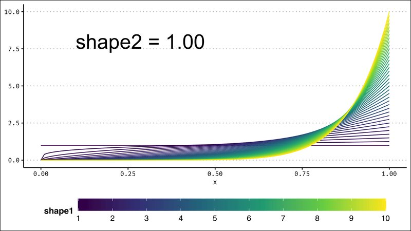

# (PART) Distributions {-}


# Physical

Every time I thought about today's prompt, by brain started playing Let's Get Physical by Olivia Newton John. If you haven't watched the [video](https://www.youtube.com/watch?v=vWz9VN40nCA), it's a real 80s experience. I'm going to try to theme the plot after the video.


So I decided to adapt some code from a tutorial I wrote on [spotifyr](https://psyteachr.github.io/ads-v1/spotify-data.html), which is based on a [tutorial by Michael Mullarkey](https://mcmullarkey.github.io/mcm-blog/posts/2022-01-07-spotify-api-r/). You can check those tutorials for the setup details if you haven't used `r pkg("spotifyr")` before.

```{r, message=FALSE}
library(spotifyr)   # to access Spotify
library(tidyverse)  # for data wrangling
```

## Get song ID

This step requires access to spotify and you can get timed out if you try to access it too much, so I always save the result of calls to an API in scripts and set that code chunk to `eval = FALSE` so it doesn't run every time I render this book.

```{r, eval = FALSE}
# set to eval = FALSE to avoid too many call to spotify API
onj <- get_artist_audio_features(
  artist = 'Olivia Newton John',
  include_groups = "album"
)
saveRDS(onj, "data/onj.rds")
```

Now I can search the tracks for "Physical". I'll choose the earliest release.

```{r}
onj <- readRDS("data/onj.rds")

physical_id <- onj %>%
  filter(track_name == "Physical") %>%
  filter(album_release_year == min(album_release_year)) %>%
  pull(track_id)

physical_id
```

## Song Analysis

Get the song analysis. It's a list with a bunch of info.

```{r, eval = FALSE}
# set to eval = FALSE to avoid too many call to spotify API
song_analysis <- get_track_audio_analysis(physical_id)
saveRDS(song_analysis, "data/song_analysis.rmd")
```

```{r}
song_analysis <- readRDS("data/song_analysis.rmd")
```


* `meta` gives you a list of some info about the analysis.
* `track` gives you a list of attributes, including `duration`, `loudness`, `end_of_fade_in`, `start_of_fade_out`, and `time_signature`. Some of this info was available in the artist table.
* `bars`, `beats`, and `tatums` are tables with the `start`, `duration` and `confidence` for each bar, beat, or tatum of music (whatever a "tatum" is).
* `sections` is a table with the start, duration, loudness, tempo, key, mode, and time signature for each section of music, along with confidence measures of each.
* `segments` is a table with information about loudness, pitch and timbre of segments of analysis, which tend to be around 0.2 seconds.

## Pitches

The column `pitches` of the segments table has 12 values representing the degree of occurrence for each note in each time segment, so we have to unpack this a bit.

```{r}
pitch_analysis <- song_analysis$segments %>%
  unnest(pitches) %>%
  rename(pitch_degree = pitches) %>%
  group_by(start) %>%
  mutate(pitch = row_number()-1) %>%
  ungroup() %>%
  filter(pitch_degree == 1) %>%
  select(start, duration, loudness_start, pitch)

head(pitch_analysis)
```

Now I want to figure out the main pitch for each beat, so I need to somehow map the pitch table to the beat table. First, I need to work out the main segment in each beat.

```{r}
seg <- song_analysis$segments %>%
  select(seg_start = start, seg_dur = duration)

beat <- song_analysis$beats %>%
  select(beat_start = start, beat_dur = duration)

main_seg_in_beat <- inner_join(seg, beat, by = character()) %>%
  mutate(seg_end = seg_start + seg_dur, 
         beat_end = beat_start + beat_dur,
         seg_in_beat = (seg_start <= beat_end) & (seg_end >= beat_start)) %>%
  filter(seg_in_beat) %>%
  rowwise() %>%
  mutate(overlap = min(seg_end, beat_end) - max(c(seg_start, beat_start)),
         pcnt_in_beat = overlap/beat_dur) %>%
  group_by(beat_start) %>%
  slice_max(order_by = pcnt_in_beat, n = 1) %>%
  ungroup()

head(main_seg_in_beat)
```

And then join this with the pitch analysis table to get a main pitch for each beat.

```{r}
pitch_by_beat <- main_seg_in_beat %>%
  select(start = seg_start) %>%
  left_join(pitch_analysis, "start")

head(pitch_by_beat)
```

## Plot Pitch by Beat

```{r physical-pitch}
ggplot(pitch_by_beat,
       aes(x = start, y = pitch, color = loudness_start)) +
  geom_point(show.legend = FALSE)
```

## Plot Key by Segment

I also wanted to map the key of each segment using a horizontal linerange, so I mapped it vertically first and flipped the coordinates.

```{r physical-key}
ggplot(song_analysis$sections, aes(ymin = start, 
                               ymax = start + duration,
                               x = key)) +
  geom_linerange(size = 10) +
  coord_flip()
```

## Combine Plots

So to combine them, I need to move the data and mapping to the relevant geoms and swap the x and y coordinates for the pitch points.

```{r physical-combo}
ggplot() +
  geom_linerange(mapping = aes(ymin = start, 
                               ymax = start + duration,
                               x = key),
                 data = song_analysis$sections,
                 size = 6) +
  coord_flip() +
  geom_point(mapping = aes(y = start, x = pitch, color = loudness_start),
             data = pitch_by_beat, show.legend = FALSE)
```


## 80s Theme

Let's remind ourselves of this monstrosity.


```{r physical-theme}
# translate spotify's 0-11 to notes
pitch_key_vals <- c('C', 'C#/Db', 'D', 'D#/Eb', 'E', 'F', 
                     'F#/Gb', 'G', 'G#/Ab', 'A', 'A#/Bb', 'B')

ggplot() +
  geom_linerange(mapping = aes(ymin = start, 
                               ymax = start + duration,
                               x = key),
                 data = song_analysis$sections,
                 size = 10,
                 color = "#60E1FE") +
  coord_flip() +
  geom_point(mapping = aes(y = start, x = pitch, alpha = loudness_start),
             data = pitch_by_beat, 
             color = "#BB1DA8", size = 3,
             show.legend = FALSE) +
  scale_y_continuous(breaks = seq(0, 250, 10)) +
  scale_x_continuous(breaks = 0:11,
                     labels = pitch_key_vals) +
  scale_alpha(range = c(0, .6)) +
  labs(x = "Key/Pitch",
       y = NULL,
       title = "Let's Get Physical — Olivia Newton John",
       subtitle = "Main pitch for each beat (in pink) and key for each segment (in blue)",
       caption = "Data from Spotify via spotifyr | plot by @lisadebruine")  +
  theme_bw() +
  theme(plot.subtitle = element_text(color = "red"),
        panel.background = element_rect(fill = "#091131"),
        panel.grid.major.y = element_blank(),
        panel.grid.minor.x = element_blank())
```

OK, that's awful and I'm sorry.

```{r, include = FALSE, eval = FALSE}
ggsave("images/day7.png", width = 8, height = 4.5, device = png)
```


# Mountains

Munros are the hills in Scotland over 3000 feet high. Many Scottish people are obsessed with [Munro bagging](https://www.visitscotland.com/see-do/active/walking/munro-bagging/) — trying to see how many of the 282 Munros you can climb. I've lived in Scotland since 2003, but I still haven't been up a Munro!

So I thought for the mountains prompt, I'd map all of the Munros in Scotland by height. Then someday, when I bag a munro, I can mark it on the map.

```{r, message=FALSE}
library(tidyverse)     # for data wrangling
library(sf)            # for maps
library(rnaturalearth) # for map coordinates
library(ggthemes)      # for the map theme
library(plotly)        # for interactive plots
library(showtext)      # for fonts

# install a good Scottish font
font_add(family = "Hill House",
         regular = "~/Library/Fonts/Hill_House.otf")
showtext_auto()
```

## Data

[The Database of British and Irish Hills v17.3 ](http://www.hills-database.co.uk/downloads.html) has a table of the Munros, with columns for many years (I guess which hills are classified as Munros changes over time). Let's get just the current munros and fix some of the names.

```{r}
munros <- read_csv("data/munrotab_v8.0.1.csv",
                   show_col_types = FALSE) %>%
  filter(`2021` == "MUN") %>%
  select(-c(`1891`:`2021`)) %>% # get rid of the year columns
  rename(height_m = "Height (m)", 
         height_ft = "Height\n(ft)")
```

Make a quick histogram of their heights to get an overview of the data. I'd usually use the metric system, but since Munros are defined as hills over 3000 feet, I'll use feet.

```{r mountains-histogram}
ggplot(munros, aes(x = height_ft)) +
  geom_histogram(binwidth = 100, boundary = 0, 
                 color = "black", fill = "white")
```

## Map of Scotland

Now I need a map of Scotland.

```{r}
scotland_sf <- ne_states(geounit = "Scotland", 
                         returnclass = "sf")
```

The munro table locates the peaks using grid coordinates, and the map uses latitude and longitude. So I translated the grid coordinates to latitude and longitude using [Stackoverflow code from hrbrmstr](https://stackoverflow.com/questions/23017053/how-to-convert-uk-grid-reference-to-latitude-and-longitude-in-r).


```{r, echo = FALSE}
# takes numeric east/north generated from the os.grid.parse() function
# i shld have made it take the vector the os.grid.parse() returns but 
# we'll save that for a proper package version

os.grid.to.lat.lon <- function(E, N) {

  a <- 6377563.396
  b <- 6356256.909
  F0 <- 0.9996012717
  lat0 <- 49*pi/180
  lon0 <- -2*pi/180
  N0 <- -100000
  E0 <- 400000
  e2 <- 1 - (b^2)/(a^2)
  n <- (a-b)/(a+b)
  n2 <- n^2
  n3 <- n^3

  lat <- lat0
  M <- 0

  repeat {

    lat <- (N-N0-M)/(a*F0) + lat

    Ma <- (1 + n + (5/4)*n2 + (5/4)*n3) * (lat-lat0)
    Mb <- (3*n + 3*n*n + (21/8)*n3) * sin(lat-lat0) * cos(lat+lat0)
    Mc <- ((15/8)*n2 + (15/8)*n3) * sin(2*(lat-lat0)) * cos(2*(lat+lat0))
    Md <- (35/24)*n3 * sin(3*(lat-lat0)) * cos(3*(lat+lat0))
    M <- b * F0 * (Ma - Mb + Mc - Md)

    if (N-N0-M < 0.00001) { break }

  }

  cosLat <- cos(lat)
  sinLat <- sin(lat)

  nu <- a*F0/sqrt(1-e2*sinLat*sinLat)
  rho <- a*F0*(1-e2)/((1-e2*sinLat*sinLat)^1.5)

  eta2 <- nu/rho-1

  tanLat <- tan(lat)
  tan2lat <- tanLat*tanLat
  tan4lat <- tan2lat*tan2lat
  tan6lat <- tan4lat*tan2lat

  secLat <- 1/cosLat
  nu3 <- nu*nu*nu
  nu5 <- nu3*nu*nu
  nu7 <- nu5*nu*nu

  VII <- tanLat/(2*rho*nu)
  VIII <- tanLat/(24*rho*nu3)*(5+3*tan2lat+eta2-9*tan2lat*eta2)
  IX <- tanLat/(720*rho*nu5)*(61+90*tan2lat+45*tan4lat)
  X <- secLat/nu
  XI <- secLat/(6*nu3)*(nu/rho+2*tan2lat)
  XII <- secLat/(120*nu5)*(5+28*tan2lat+24*tan4lat)
  XIIA <- secLat/(5040*nu7)*(61+662*tan2lat+1320*tan4lat+720*tan6lat)

  dE <- (E-E0)
  dE2 <- dE*dE
  dE3 <- dE2*dE
  dE4 <- dE2*dE2
  dE5 <- dE3*dE2
  dE6 <- dE4*dE2
  dE7 <- dE5*dE2

  lon <- lon0 + X*dE - XI*dE3 + XII*dE5 - XIIA*dE7
  lat <- lat - VII*dE2 + VIII*dE4 - IX*dE6

  lat <- lat * 180/pi
  lon <- lon * 180/pi

  return(c(lat, lon))

}

```


```{r}
latlon <- map2(munros$xcoord, munros$ycoord, os.grid.to.lat.lon)

munros$lat <- map_dbl(latlon, `[[`, 1)
munros$lon <- map_dbl(latlon, `[[`, 2)
```

Then plot the latitude and longitude coordinates on the map, colored by height.

```{r mountains-map, fig.width = 5, fig.height = 8}
ggplot() + 
  geom_sf(data = scotland_sf,
          mapping = aes(),
          color = "black", 
          fill = "grey",
          size = .1) +
  coord_sf(xlim = c(-8, 0), ylim = c(54, 61)) +
  geom_point(aes(x = lon, y = lat, color = height_ft), munros) +
  theme_map()
```


## Make it prettier

There's no munros on the Northern Isles, so I've cropped them out of the map. I also made the colours better. I added a label to `geom_point()`, which will produce a warning that it isn't used, but you'll see why in the next step.

```{r mountains-pretty, fig.width = 4.5, fig.height = 6, warning=FALSE}
munro_plot <- ggplot() + 
  geom_sf(data = scotland_sf,
          mapping = aes(),
          color = "chocolate4", 
          fill = "tan",
          size = .1) +
  coord_sf(xlim = c(-7.4, -2), ylim = c(54.8, 58.5)) +
  geom_point(aes(label = Name, color = height_ft, y = lat, x = lon), 
             data = arrange(munros, height_ft),
             size = 0.5) +
  scale_color_viridis_c(name = "Height (ft)",
                        limits = c(3000, 4500)) +
  labs(x = NULL, y = NULL,
       title = "The Munros of Scotland",
       caption = "Data from The Database of British and Irish Hills | Plot by @lisadebruine") +
  theme_map() +
  theme(legend.position = c(0, 0),
        legend.background = element_blank(),
        panel.background = element_rect(fill = "transparent", color = "transparent"),
        plot.background = element_rect(fill = "lightskyblue1", color = "transparent"),
        plot.title = element_text(family = "Hill House", size = 26, hjust = .5)
  )

munro_plot
```

```{r, include = FALSE, eval = FALSE}
ggsave("images/day8.png", plot = munro_plot, 
       width = 4.5, height = 6, device = png)
```

## Make it interactive

The `r pkg("plotly")` package makes it pretty easy to make a ggplot interactive. Select an are to get a closer look, or hover over an individual munro to see why we added the unused `label` argument to `geom_point()` above.

I had to add some css to get the hover bar to stop acting wierd, but it's still not quite right.

```{verbatim}
.js-plotly-plot .plotly .modebar { position: relative; top: -2em; }
.plotly.plot-container { padding-top: 2em; background-color: #B0E1FE;}
```

<style>
.js-plotly-plot .plotly .modebar { position: relative; top: -2em; }
.plotly.plot-container { padding-top: 2em; background-color: #B0E1FE;}
</style>

```{r mountains-interactive, fig.width = 5, fig.height = 6}
plotly::ggplotly(
  p = munro_plot, 
  tooltip = c("label", "colour")
)
```


# Statistics

```{r, message = FALSE}
library(tidyverse) # for everything
library(gifski)    # for making the gif
library(viridis)   # for nicer colours
theme_set(ggthemes::theme_clean())
```

The beta distribution is interesting because it has two parameters that you can vary, so it's been a challenge to visualise. But now that I'm getting better at animated plots, I thought I could try to visualise variation in the shape1 parameter with line colour and variation in shape2 with animation.

## Make one frame

As always, make one frame first. You can use `stat_function()` to plot data from a distribution using functions like `dnorm()`, and `dbeta()`. I can't figure out how to set the `args` from the mapping, so I'm using a for loop to add each density line. This feels inefficient, but it works.

```{r}
g <- ggplot() +  xlim(0, 1) + ylim(0, 10)

dat <- crossing(
  shape1 = seq(1, 10, .25),
  shape2 = 5
)
colours <- viridis(nrow(dat))

for (i in seq_along(colours)) {
  g <- g + stat_function(color = colours[i],
                fun = dbeta, 
                args = list(shape1 = dat$shape1[i], 
                            shape2 = dat$shape2[i]))
}

g
```

Colours for each line come from `viridis()`, but this won't give you a colour guide, so add `geom_density(aes(x = 1, color = 1), alpha = 0)` to make an invisible line that generates a colour guide that you can modify with `scale_color_viridis_c()`. This will generate a warning, so you can turn off warnings in the code chunk.

Clean up the plot and add an annotation for the shape2 value.

```{r, warning=FALSE}
label <- sprintf("shape2 = %.2f", 2)

g + labs(x = NULL, y = NULL) +
  annotate(x = 0.1, y = 8, label = label, geom = "text", 
             hjust = 0, size = 6) + 
  theme(text = element_text(family = "sans"),
        legend.position = "bottom",
        legend.background = element_blank(),
        legend.key.width = unit(.15, "npc")) +
  geom_density(aes(x = 1, color = 1), alpha = 0) +
  scale_color_viridis_c(name = "shape1", limits = c(1, 10), breaks = 1:10)

```

## Functionalise it

Now turn this into a function so you can vary shape1 and shape2.

```{r}
beta_plot <- function(shape1 = 1, shape2 = 2) {
  g <- ggplot() + xlim(0, 1) + ylim(0, 10)

  dat <- crossing(
    shape1 = shape1,
    shape2 = shape2
  )
  colours <- viridis(nrow(dat))
  
  for (i in seq_along(colours)) {
    g <- g + stat_function(color = colours[i],
                  fun = dbeta, 
                  args = list(shape1 = dat$shape1[i], 
                              shape2 = dat$shape2[i]))
  }

  label <- sprintf("shape2 = %.2f", shape2)
  g <- g + labs(y = NULL) +
    annotate(x = 0.1, y = 8, 
             label = label, geom = "text", 
             hjust = 0, size = 10) +
    theme(text = element_text(family = "sans"),
          legend.position = "bottom",
          legend.background = element_blank(),
          legend.key.width = unit(.15, "npc")) +
    geom_density(aes(x = 1, color = 1), alpha = 0) +
    scale_color_viridis_c(name = "shape1 = ", 
                          limits = c(1, 10), 
                          breaks = 1:10)
  
  f <- tempfile(fileext = ".png")
  ggsave(f, g, width = 8, height = 4.5, device = png)
  
  f
}
```

Map the function over a range of shape2 values. Keep shape1 always the same vector.

```{r, eval = FALSE}
beta_plots <- map_chr(c(seq(1, 5, .25)), 
                      beta_plot, 
                      shape1 = seq(1, 10, .25))
```

## Animate

Combine the plots in forward order with the same plots in reverse order to make the gif go back and forth, then save to a gif.

```{r, eval = FALSE}
c(beta_plots, rev(beta_plots)) %>%
  gifski(gif_file = "images/day9.gif", 
         width = 800, height = 450, delay = 0.1)
```

```{r, echo = FALSE}

```


# Experimental

# Circular

# The Economist


