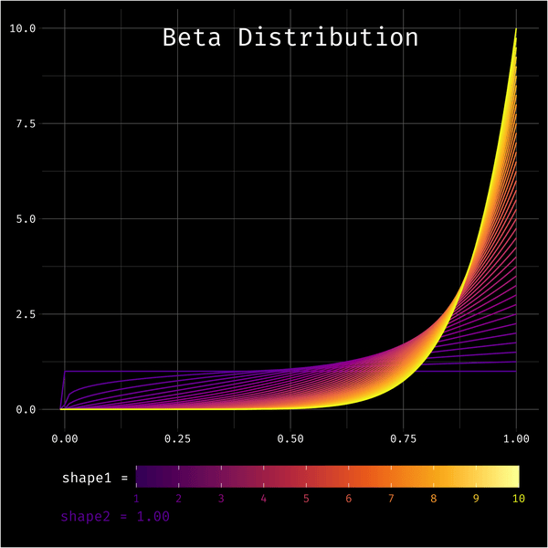

# (PART) Distributions {-}


# Physical

Every time I thought about today's prompt, by brain started playing Let's Get Physical by Olivia Newton John. If you haven't watched the [video](https://www.youtube.com/watch?v=vWz9VN40nCA), it's a real 80s experience. I'm going to try to theme the plot after the video.


So I decided to adapt some code from a tutorial I wrote on [spotifyr](https://psyteachr.github.io/ads-v1/spotify-data.html), which is based on a [tutorial by Michael Mullarkey](https://mcmullarkey.github.io/mcm-blog/posts/2022-01-07-spotify-api-r/). You can check those tutorials for the setup details if you haven't used `r pkg("spotifyr")` before.

```{r, message=FALSE}
library(spotifyr)   # to access Spotify
library(tidyverse)  # for data wrangling
```

## Get song ID

This step requires access to spotify and you can get timed out if you try to access it too much, so I always save the result of calls to an API in scripts and set that code chunk to `eval = FALSE` so it doesn't run every time I render this book.

```{r, eval = FALSE}
# set to eval = FALSE to avoid too many call to spotify API
onj <- get_artist_audio_features(
  artist = 'Olivia Newton John',
  include_groups = "album"
)
saveRDS(onj, "data/onj.rds")
```

Now I can search the tracks for "Physical". I'll choose the earliest release.

```{r}
onj <- readRDS("data/onj.rds")

physical_id <- onj %>%
  filter(track_name == "Physical") %>%
  filter(album_release_year == min(album_release_year)) %>%
  pull(track_id)

physical_id
```

## Song Analysis

Get the song analysis. It's a list with a bunch of info.

```{r, eval = FALSE}
# set to eval = FALSE to avoid too many call to spotify API
song_analysis <- get_track_audio_analysis(physical_id)
saveRDS(song_analysis, "data/song_analysis.rmd")
```

```{r}
song_analysis <- readRDS("data/song_analysis.rmd")
```


* `meta` gives you a list of some info about the analysis.
* `track` gives you a list of attributes, including `duration`, `loudness`, `end_of_fade_in`, `start_of_fade_out`, and `time_signature`. Some of this info was available in the artist table.
* `bars`, `beats`, and `tatums` are tables with the `start`, `duration` and `confidence` for each bar, beat, or tatum of music (whatever a "tatum" is).
* `sections` is a table with the start, duration, loudness, tempo, key, mode, and time signature for each section of music, along with confidence measures of each.
* `segments` is a table with information about loudness, pitch and timbre of segments of analysis, which tend to be around 0.2 seconds.

## Pitches

The column `pitches` of the segments table has 12 values representing the degree of occurrence for each note in each time segment, so we have to unpack this a bit.

```{r}
pitch_analysis <- song_analysis$segments %>%
  unnest(pitches) %>%
  rename(pitch_degree = pitches) %>%
  group_by(start) %>%
  mutate(pitch = row_number()-1) %>%
  ungroup() %>%
  filter(pitch_degree == 1) %>%
  select(start, duration, loudness_start, pitch)

head(pitch_analysis)
```

Now I want to figure out the main pitch for each beat, so I need to somehow map the pitch table to the beat table. First, I need to work out the main segment in each beat.

```{r}
seg <- song_analysis$segments %>%
  select(seg_start = start, seg_dur = duration)

beat <- song_analysis$beats %>%
  select(beat_start = start, beat_dur = duration)

main_seg_in_beat <- inner_join(seg, beat, by = character()) %>%
  mutate(seg_end = seg_start + seg_dur, 
         beat_end = beat_start + beat_dur,
         seg_in_beat = (seg_start <= beat_end) & (seg_end >= beat_start)) %>%
  filter(seg_in_beat) %>%
  rowwise() %>%
  mutate(overlap = min(seg_end, beat_end) - max(c(seg_start, beat_start)),
         pcnt_in_beat = overlap/beat_dur) %>%
  group_by(beat_start) %>%
  slice_max(order_by = pcnt_in_beat, n = 1) %>%
  ungroup()

head(main_seg_in_beat)
```

And then join this with the pitch analysis table to get a main pitch for each beat.

```{r}
pitch_by_beat <- main_seg_in_beat %>%
  select(start = seg_start) %>%
  left_join(pitch_analysis, "start")

head(pitch_by_beat)
```

## Plot Pitch by Beat

```{r physical-pitch}
ggplot(pitch_by_beat,
       aes(x = start, y = pitch, color = loudness_start)) +
  geom_point(show.legend = FALSE)
```

## Plot Key by Segment

I also wanted to map the key of each segment using a horizontal linerange, so I mapped it vertically first and flipped the coordinates.

```{r physical-key}
ggplot(song_analysis$sections, aes(ymin = start, 
                               ymax = start + duration,
                               x = key)) +
  geom_linerange(size = 10) +
  coord_flip()
```

## Combine Plots

So to combine them, I need to move the data and mapping to the relevant geoms and swap the x and y coordinates for the pitch points.

```{r physical-combo}
ggplot() +
  geom_linerange(mapping = aes(ymin = start, 
                               ymax = start + duration,
                               x = key),
                 data = song_analysis$sections,
                 size = 6) +
  coord_flip() +
  geom_point(mapping = aes(y = start, x = pitch, color = loudness_start),
             data = pitch_by_beat, show.legend = FALSE)
```


## 80s Theme

Let's remind ourselves of this monstrosity.


```{r physical-theme}
# translate spotify's 0-11 to notes
pitch_key_vals <- c('C', 'C#/Db', 'D', 'D#/Eb', 'E', 'F', 
                     'F#/Gb', 'G', 'G#/Ab', 'A', 'A#/Bb', 'B')

ggplot() +
  geom_linerange(mapping = aes(ymin = start, 
                               ymax = start + duration,
                               x = key),
                 data = song_analysis$sections,
                 size = 10,
                 color = "#60E1FE") +
  coord_flip() +
  geom_point(mapping = aes(y = start, x = pitch, alpha = loudness_start),
             data = pitch_by_beat, 
             color = "#BB1DA8", size = 3,
             show.legend = FALSE) +
  scale_y_continuous(breaks = seq(0, 250, 10)) +
  scale_x_continuous(breaks = 0:11,
                     labels = pitch_key_vals) +
  scale_alpha(range = c(0, .6)) +
  labs(x = "Key/Pitch",
       y = NULL,
       title = "Let's Get Physical — Olivia Newton John",
       subtitle = "Main pitch for each beat (in pink) and key for each segment (in blue)",
       caption = "Data from Spotify via spotifyr | plot by @lisadebruine")  +
  theme_bw() +
  theme(plot.subtitle = element_text(color = "red"),
        panel.background = element_rect(fill = "#091131"),
        panel.grid.major.y = element_blank(),
        panel.grid.minor.x = element_blank())
```

OK, that's awful and I'm sorry.

```{r, include = FALSE, eval = FALSE}
ggsave("images/day7.png", width = 8, height = 4.5, device = png)
```


# Mountains

Munros are the hills in Scotland over 3000 feet high. Many Scottish people are obsessed with [Munro bagging](https://www.visitscotland.com/see-do/active/walking/munro-bagging/) — trying to see how many of the 282 Munros you can climb. I've lived in Scotland since 2003, but I still haven't been up a Munro!

So I thought for the mountains prompt, I'd map all of the Munros in Scotland by height. Then someday, when I bag a munro, I can mark it on the map.

```{r, message=FALSE}
library(tidyverse)     # for data wrangling
library(sf)            # for maps
library(rnaturalearth) # for map coordinates
library(ggthemes)      # for the map theme
library(plotly)        # for interactive plots
library(showtext)      # for fonts

# install a good Scottish font
font_add(family = "Hill House",
         regular = "~/Library/Fonts/Hill_House.otf")
showtext_auto()
```

## Data

[The Database of British and Irish Hills v17.3 ](http://www.hills-database.co.uk/downloads.html) has a table of the Munros, with columns for many years (I guess which hills are classified as Munros changes over time). Let's get just the current munros and fix some of the names.

```{r}
munros <- read_csv("data/munrotab_v8.0.1.csv",
                   show_col_types = FALSE) %>%
  filter(`2021` == "MUN") %>%
  select(-c(`1891`:`2021`)) %>% # get rid of the year columns
  rename(height_m = "Height (m)", 
         height_ft = "Height\n(ft)")
```

Make a quick histogram of their heights to get an overview of the data. I'd usually use the metric system, but since Munros are defined as hills over 3000 feet, I'll use feet.

```{r mountains-histogram}
ggplot(munros, aes(x = height_ft)) +
  geom_histogram(binwidth = 100, boundary = 0, 
                 color = "black", fill = "white")
```

## Map of Scotland

Now I need a map of Scotland.

```{r}
scotland_sf <- ne_states(geounit = "Scotland", 
                         returnclass = "sf")
```

The munro table locates the peaks using grid coordinates, and the map uses latitude and longitude. So I translated the grid coordinates to latitude and longitude using [Stackoverflow code from hrbrmstr](https://stackoverflow.com/questions/23017053/how-to-convert-uk-grid-reference-to-latitude-and-longitude-in-r).


```{r, echo = FALSE}
# takes numeric east/north generated from the os.grid.parse() function
# i shld have made it take the vector the os.grid.parse() returns but 
# we'll save that for a proper package version

os.grid.to.lat.lon <- function(E, N) {

  a <- 6377563.396
  b <- 6356256.909
  F0 <- 0.9996012717
  lat0 <- 49*pi/180
  lon0 <- -2*pi/180
  N0 <- -100000
  E0 <- 400000
  e2 <- 1 - (b^2)/(a^2)
  n <- (a-b)/(a+b)
  n2 <- n^2
  n3 <- n^3

  lat <- lat0
  M <- 0

  repeat {

    lat <- (N-N0-M)/(a*F0) + lat

    Ma <- (1 + n + (5/4)*n2 + (5/4)*n3) * (lat-lat0)
    Mb <- (3*n + 3*n*n + (21/8)*n3) * sin(lat-lat0) * cos(lat+lat0)
    Mc <- ((15/8)*n2 + (15/8)*n3) * sin(2*(lat-lat0)) * cos(2*(lat+lat0))
    Md <- (35/24)*n3 * sin(3*(lat-lat0)) * cos(3*(lat+lat0))
    M <- b * F0 * (Ma - Mb + Mc - Md)

    if (N-N0-M < 0.00001) { break }

  }

  cosLat <- cos(lat)
  sinLat <- sin(lat)

  nu <- a*F0/sqrt(1-e2*sinLat*sinLat)
  rho <- a*F0*(1-e2)/((1-e2*sinLat*sinLat)^1.5)

  eta2 <- nu/rho-1

  tanLat <- tan(lat)
  tan2lat <- tanLat*tanLat
  tan4lat <- tan2lat*tan2lat
  tan6lat <- tan4lat*tan2lat

  secLat <- 1/cosLat
  nu3 <- nu*nu*nu
  nu5 <- nu3*nu*nu
  nu7 <- nu5*nu*nu

  VII <- tanLat/(2*rho*nu)
  VIII <- tanLat/(24*rho*nu3)*(5+3*tan2lat+eta2-9*tan2lat*eta2)
  IX <- tanLat/(720*rho*nu5)*(61+90*tan2lat+45*tan4lat)
  X <- secLat/nu
  XI <- secLat/(6*nu3)*(nu/rho+2*tan2lat)
  XII <- secLat/(120*nu5)*(5+28*tan2lat+24*tan4lat)
  XIIA <- secLat/(5040*nu7)*(61+662*tan2lat+1320*tan4lat+720*tan6lat)

  dE <- (E-E0)
  dE2 <- dE*dE
  dE3 <- dE2*dE
  dE4 <- dE2*dE2
  dE5 <- dE3*dE2
  dE6 <- dE4*dE2
  dE7 <- dE5*dE2

  lon <- lon0 + X*dE - XI*dE3 + XII*dE5 - XIIA*dE7
  lat <- lat - VII*dE2 + VIII*dE4 - IX*dE6

  lat <- lat * 180/pi
  lon <- lon * 180/pi

  return(c(lat, lon))

}

```


```{r}
latlon <- map2(munros$xcoord, munros$ycoord, os.grid.to.lat.lon)

munros$lat <- map_dbl(latlon, `[[`, 1)
munros$lon <- map_dbl(latlon, `[[`, 2)
```

Then plot the latitude and longitude coordinates on the map, colored by height.

```{r mountains-map, fig.width = 5, fig.height = 8}
ggplot() + 
  geom_sf(data = scotland_sf,
          mapping = aes(),
          color = "black", 
          fill = "grey",
          size = .1) +
  coord_sf(xlim = c(-8, 0), ylim = c(54, 61)) +
  geom_point(aes(x = lon, y = lat, color = height_ft), munros) +
  theme_map()
```


## Make it prettier

There's no munros on the Northern Isles, so I've cropped them out of the map. I also made the colours better. I added a label to `geom_point()`, which will produce a warning that it isn't used, but you'll see why in the next step.

```{r mountains-pretty, fig.width = 4.5, fig.height = 6, warning=FALSE}
munro_plot <- ggplot() + 
  geom_sf(data = scotland_sf,
          mapping = aes(),
          color = "chocolate4", 
          fill = "tan",
          size = .1) +
  coord_sf(xlim = c(-7.4, -2), ylim = c(54.8, 58.5)) +
  geom_point(aes(label = Name, color = height_ft, y = lat, x = lon), 
             data = arrange(munros, height_ft),
             size = 0.5) +
  scale_color_viridis_c(name = "Height (ft)",
                        limits = c(3000, 4500)) +
  labs(x = NULL, y = NULL,
       title = "The Munros of Scotland",
       caption = "Data from The Database of British and Irish Hills | Plot by @lisadebruine") +
  theme_map() +
  theme(legend.position = c(0, 0),
        legend.background = element_blank(),
        panel.background = element_rect(fill = "transparent", color = "transparent"),
        plot.background = element_rect(fill = "lightskyblue1", color = "transparent"),
        plot.title = element_text(family = "Hill House", size = 26, hjust = .5)
  )

munro_plot
```

```{r, include = FALSE, eval = FALSE}
ggsave("images/day8.png", plot = munro_plot, 
       width = 4.5, height = 6, device = png)
```

## Make it interactive

The `r pkg("plotly")` package makes it pretty easy to make a ggplot interactive. Select an are to get a closer look, or hover over an individual munro to see why we added the unused `label` argument to `geom_point()` above.

I had to add some css to get the hover bar to stop acting wierd, but it's still not quite right.

```{verbatim}
.js-plotly-plot .plotly .modebar { position: relative; top: -2em; }
.plotly.plot-container { padding-top: 2em; background-color: #B0E1FE;}
```

<style>
.js-plotly-plot .plotly .modebar { position: relative; top: -2em; }
.plotly.plot-container { padding-top: 2em; background-color: #B0E1FE;}
</style>

```{r mountains-interactive, fig.width = 5, fig.height = 6}
plotly::ggplotly(
  p = munro_plot, 
  tooltip = c("label", "colour")
)
```


# Statistics

```{r, message = FALSE}
library(tidyverse) # for everything
library(gifski)    # for making the gif
library(viridis)   # for nicer colours
library(showtext)  # for fonts

# install a good fixed-width font
font_add(family = "Fira Code",
         regular = "~/Library/Fonts/FiraCode-Regular.ttf")
showtext_auto()
```

The beta distribution is  a challenge to visualise because it has two parameters that you can vary. But now that I'm getting better at animated plots, I thought I could try to visualise variation in the shape1 parameter with line colour and variation in shape2 with animation.

## Make one frame

As always, make one frame first. You can use `stat_function()` to plot data from a distribution using functions like `dnorm()`, and `dbeta()`. I can't figure out how to set the `args` from the mapping, so I'm using a for loop to add each density line. This feels inefficient, but it works.

```{r stats-one-frame}
g <- ggplot()

dat <- crossing(
  shape1 = seq(1, 10, .25),
  shape2 = 10
)
colours <- plasma(nrow(dat), begin = .2)

for (i in seq_along(colours)) {
  g <- g + stat_function(color = colours[i],
                fun = dbeta, 
                args = list(shape1 = dat$shape1[i], 
                            shape2 = dat$shape2[i]))
}

g
```

Colours for each line come from `plasma()`, but this won't give you a colour guide, so add `geom_density(aes(x = 1, color = 1), alpha = 0)` to make an invisible line that generates a colour guide that you can modify with `scale_color_viridis_c()`. This will generate a warning, so you can turn off warnings in the code chunk.

Clean up the plot and add an annotation for the shape2 value. I finally figured out how to make an annotation outside of the panel area: set clip = "off" in `coord_cartesian()`.

```{r stats-annotated, warning=FALSE, fig.width = 6, fig.height = 6}
shape1 <- seq(1, 10, .25)
shape2 <- 10
label <- sprintf("shape2 = %.2f", shape2)

g + coord_cartesian(xlim = c(0, 1),
                    ylim = c(0, 10),
                    clip = "off") +
  labs(x = NULL, y = NULL) +
  annotate(x = .5, y = 10, label = "Beta Distribution",
           geom = "text", color = "white", family = "Fira Code",
           vjust = 1, hjust = 0.5, size = 7) +
  annotate(x = -.01, y = -2.8, label = label, 
           geom = "text", color = colours[which(shape1 == shape2)],
           family = "Fira Code", hjust = 0, size = 3.9) +
  geom_density(aes(x = 1, color = 1), alpha = 0) +
  scale_color_viridis_c(name = "shape1 =\n", 
                        option = "B", begin = .2,
                        limits = c(1, 10), breaks = 1:10) + 
  theme_dark() +
  theme(text = element_text(family = "Fira Code", color = "white"),
        axis.text = element_text(family = "Fira Code", color = "white"),
        panel.background = element_blank(),
        plot.background = element_rect(fill = "black"),
        plot.margin = unit(c(0.1, 0.1, .4, 0.1), "in"),
        legend.position = "bottom",
        legend.background = element_blank(),
        legend.text = element_text(color = plasma(10, begin = .2)),
        legend.key.width = unit(.14, "npc"))

```

## Functionalise it

Now turn this into a function so you can vary shape1 and shape2. Save the resulting plot as a PNG to a temporary file and return the filename so `r pkg("gifski")` can it to make an annotated gif.

```{r}
beta_plot <- function(shape1 = 1, shape2 = 2) {
  dat <- crossing(
    shape1 = shape1,
    shape2 = shape2
  )
  colours <- plasma(nrow(dat), begin = .2)
  label <- sprintf("shape2 = %.2f", shape2)
  
  g <- ggplot() 
  for (i in seq_along(colours)) {
    g <- g + stat_function(color = colours[i],
                  fun = dbeta, 
                  args = list(shape1 = dat$shape1[i], 
                              shape2 = dat$shape2[i]))
  }

  g <- g + coord_cartesian(xlim = c(0, 1),
                      ylim = c(0, 10),
                      clip = "off") +
    labs(x = NULL, y = NULL) +
    annotate(x = .5, y = 10, label = "Beta Distribution",
             geom = "text", color = "white", family = "Fira Code",
             vjust = 1, hjust = 0.5, size = 7) +
    annotate(x = -.01, y = -2.8, label = label, 
             geom = "text", color = colours[which(shape1 == shape2)],
             family = "Fira Code", hjust = 0, size = 3.9) +
    geom_density(aes(x = 1, color = 1), alpha = 0) +
    scale_color_viridis_c(name = "shape1 =\n", 
                          option = "B", begin = .2,
                          limits = c(1, 10), breaks = 1:10) + 
    theme_dark() +
    theme(text = element_text(family = "Fira Code", color = "white"),
          axis.text = element_text(family = "Fira Code", color = "white"),
          panel.background = element_blank(),
          plot.background = element_rect(fill = "black"),
          plot.margin = unit(c(0.1, 0.1, .4, 0.1), "in"),
          legend.position = "bottom",
          legend.background = element_blank(),
          legend.text = element_text(color = plasma(10, begin = .2)),
          legend.key.width = unit(.14, "npc"))
  
  # save to a temporary file
  f <- tempfile(fileext = ".png")
  ggsave(f, g, width = 6, height = 6, device = png)
  
  f
}
```

Test out the function. I hid a few warnings, including one about setting legend.text colour to 10 values, but it seems to work fine for now. 

```{r stats-test, warning=FALSE}
f <- beta_plot(seq(1, 10, .25), 1)
```


Map the function over a range of shape2 values. Keep shape1 always the same vector.

```{r, eval = FALSE}
beta_plots <- map_chr(c(seq(1, 10, .25)), 
                      beta_plot, 
                      shape1 = seq(1, 10, .25))
```

## Animate

Combine the plots in forward order with the same plots in reverse order to make the frames loop back and forth, then save as an animated gif.

```{r, eval = FALSE}
c(beta_plots, rev(beta_plots)) %>%
  gifski(gif_file = "images/day9.gif", 
         width = 600, height = 600, delay = 0.1)
```

```{r day9, echo = FALSE}

```


# Experimental

Today I'm going to use faux to generate some simulated data for a factorial experimental design and make some plots.

```{r}
library(faux)      # for data simulation
library(ggplot2)   # for plotting
library(patchwork) # for multi-panel plots
theme_set(theme_bw())
set.seed(8675309)  # for reproducibility
```

```{r, include = FALSE}
# reset to default
faux_options(plot = TRUE)
```


## Data

The `sim_design()` function is meant to make the simulation of data for factorial designs  easier. You can name the factors and their levels (see extensive [vignettes](https://debruine.github.io/faux/)), but here we'll just use the generic naming from faux and only specify the number of levels of each factor. By default, it simulates 100 observations in each between group, with means of 0 and standard deviations of 1. The function also produces a design plot.

### One factor

```{r exp-b2-sim}
b2 <- sim_design(between = 2, 
                 mu = c(0, 0.5))
```

For within-subject designs, you have to specify the correlation between each level. If there are any within factors, the `check_sim_stats()` table will include the sampled correlations. You can turn off the design plot with `plot = FALSE`. 

```{r}
w2 <- sim_design(within = 2, 
                 mu = c(0, 0),
                 sd = c(1, 5),
                 r = 0.5,
                 plot = FALSE)
check_sim_stats(w2)
```


### Two factors

You can also give the factors names and labels. You can set the correlations separately for each between-subject cell.

```{r}
# df version uses row and column labels, 
# so allows rows and columns to be out of order
mu <- data.frame(cat = c(0, 0.5),
                 dog = c(0.25, 1),
                 row.names = c("am", "pm"))

w2b2 <- sim_design(within = list(time = c("am", "pm")), 
                   between = list(pet = c("cat", "dog")),
                   mu = mu,
                   dv = list(y = "Something Score"),
                   r = list(cat = 0,
                            dog = .5),
                   long = TRUE)
check_sim_stats(w2b2)
```

## Plots

### Data Plots

Now it's time for the fun part: making plots! The `plot()` function makes it easy to plot data made with faux. See the [plotting vignette](https://debruine.github.io/faux/articles/plots.html) for more details.

The output is a ggplot, so you can add more ggplot options to it.

```{r exp-b2-plot}
plot(b2, geoms = c("violin", "box"), palette = "Accent") +
  ggtitle("Between-Subject Factor")
```

### Design Plots

You can also plot the design (not the data). If you plot a violin, the shape will be estimated by simulating a very large sample with these parameters.

```{r exp-w2-plot}
get_design(w2) %>%
  plot(geoms = c("violin", "pointrangeSD"), palette = "Dark2") +
  ggtitle("Within-Subject Factor")
```

### Combo Plots

Create a design plot for the main effects and interaction in `w2b2`. You can specify the order color, x, facet row(s), facet col(s) [this function needs a little work to be more intuitive]. Add a title and custom colours (you'll get a warning about the duplicate scale for fill; just ignore it).

```{r, warning=FALSE, message=FALSE}
geoms <- c("violin", "pointrangeSD")
b_colors <- scale_color_manual(values = c("red3", "dodgerblue3"), guide = "none")
w_colors <- scale_color_manual(values = c("darkorchid", "darkorange"), guide = "none")
b_fill <- scale_fill_manual(values = c("red3", "dodgerblue3"), guide = "none")
w_fill <- scale_fill_manual(values = c("darkorchid", "darkorange"), guide = "none")

plot_b2 <- get_design(w2b2) %>% 
  plot(geoms = geoms, "pet", "pet") + 
  b_colors + b_fill +
  labs(x = NULL, title = "Main Effect of Pet Type")

plot_w2 <- get_design(w2b2) %>% 
  plot(geoms = geoms, "time", "time") + 
  w_colors + w_fill +
  labs(x = NULL, title = "Main Effect of Time of Day")

plot_w2b2 <- get_design(w2b2) %>% 
  plot(geoms = geoms, "time", "pet") + 
  w_colors + w_fill +
  labs(x = NULL, title = "Interaction between Time of Day and Pet Type")

plot_b2w2 <- get_design(w2b2) %>% 
  plot(geoms = geoms, "pet", "time") + 
  b_colors + b_fill +
  labs(x = NULL, title = "Interaction between Pet Type and Time of Day")
```

Combine with `r pkg("patchwork")` 

```{r exp-day10, fig.width = 8, fig.height = 8}
layout <- paste("AB", "CC", "DD", sep = "\n")
plot_b2  + plot_w2 + plot_w2b2 + plot_b2w2 +
  plot_layout(design = layout)
```

```{r, include = FALSE, eval = FALSE}
ggsave("images/day10.png", width = 8, height = 8, device = png)
```


# Circular

I've never used `coord_polar()` before, but it seems pretty good for when you want to show values that vary a lot in magnitude between categories.

```{r, message=FALSE}
library(tidyverse) # for wrangling data
```

## Data

I downloaded the [UK sexual orientation data](https://www.ons.gov.uk/peoplepopulationandcommunity/culturalidentity/sexuality/bulletins/sexualidentityuk/2019) from the Office for National Statistics. It needs a little cleaning first. I'll leave it wide because I just want to plot the most recent year.

```{r}
ukso <- read_csv("data/uk_sexual-orientation_8c21318e.csv",
                 skip = 3, n_max = 5, 
                 show_col_types = FALSE) %>%
  mutate(`Sexual orientation` = gsub("\n", "", `Sexual orientation`),
         `Sexual orientation` = gsub(" or ", "/", `Sexual orientation`),
         `Sexual orientation` = factor(`Sexual orientation`, `Sexual orientation`))

ukso
```

I wish they'd distinguished "don't know" and "don't want to tell you"; they're two very different things.

## Simple Polar Plot

My first thought was to just add `coord_polar()` to a bar plot. Not quite. I kind of hate this plot style, but at least I know how to make one now.

```{r circular-polar}
ggplot(ukso, aes(x = `Sexual orientation`, 
                 y = `2019`, 
                 fill = `Sexual orientation`)) +
  geom_col() +
  coord_polar()
```


## Polar Y

If you set `theta = "y"`, you get a different type of polar plot. 

```{r circular-y}
ggplot(ukso, aes(x = `Sexual orientation`,
                 y = `2019`, 
                 fill = `Sexual orientation`)) + 
  geom_col() +
  coord_polar(theta = "y")
```


This is closer to what I want, but I'm not keen on the x-axis limit being defined by the largest group and the y-axis needs to go.

## Fix it up

I reversed the order of the categories by setting `limits = rev` in `scale_x_discrete()` and made some space in the middle by setting the `expand` argument to add 3 "columns" of space to the inside.

I added `geom_text()` to include the exactly values at the end of each bar. I had to use trial and error to get the angles to match. I also used `theme()` to get rid of the y-axis.

```{r circular-fix}
ggplot(ukso, aes(x = `Sexual orientation`, 
                 y = `2019`, 
                 fill = `Sexual orientation`, 
                 color = `Sexual orientation`)) + 
  geom_col(width = 1, color = "black") +
  geom_text(aes(label = paste0(`2019`, "%"),
                angle = c(15, -10, -10, -10, -10)), 
            size = 3, nudge_y = 0.5, hjust = 0) +
  coord_polar(theta = "y") +
  scale_x_discrete(expand = expansion(add = c(3, 0)), limits = rev) +
  scale_y_continuous(breaks = seq(0, 90, 10), 
                     labels = paste0(seq(0, 90, 10), "%"),
                     limits = c(0, 100)) +
  theme(axis.ticks = element_blank(),
        axis.text.y = element_blank(),
        axis.title = element_blank())
```

## Theme

Now I'll really customise the appearance. I found the `theme()` function intimidating at first, but once you work with it for a bit and get your head around the `element_*` functions, it's straightforward and very powerful. I just wish I could figure out how to put the plot caption in the margin like I did for the legend.

```{r circular-day11, fig.width = 5, fig.height = 5}
rbcol <- c("red3", 
           "darkgoldenrod1", 
           "springgreen3", 
           "dodgerblue2", 
           "darkorchid")

ggplot(ukso, aes(x = `Sexual orientation`, 
                 y = `2019`, 
                 fill = `Sexual orientation`, 
                 color = `Sexual orientation`)) + 
  geom_col(width = 1, color = "black") +
  geom_text(aes(label = paste0(`2019`, "%"),
                angle = c(15, -10, -10, -10, -10)), 
            size = 3, nudge_y = 0.5, hjust = 0) +
  coord_polar(theta = "y") +
  scale_fill_manual(values = rbcol) +
  scale_color_manual(values = rbcol) +
  scale_x_discrete(expand = expansion(add = c(3, 0)), limits = rev) +
  scale_y_continuous(breaks = seq(0, 90, 10), 
                     labels = paste0(seq(0, 90, 10), "%"),
                     limits = c(0, 100)) +
  labs(title = "Sexual Orientation in the UK (2019)",
       caption = "Data from the UK Office for National Statistics\nPlot by @lisadebruine for the 2022 #30DayChartChallenge") +
  theme_dark() +
  theme(
    axis.ticks = element_blank(),
    axis.text.y = element_blank(),
    axis.title = element_blank(),
    panel.border = element_blank(),
    panel.grid.major.x = element_blank(),
    panel.grid.major.y = element_line(color = "grey60"),
    panel.grid.minor.y = element_line(color = "grey30"),
    panel.background = element_blank(),
    plot.background = element_rect(fill = "black", color = "transparent"),
    plot.margin = unit(c(.15, 0, 0, 1.1), "in"),
    text = element_text(color = "white"),
    plot.title = element_text(hjust = 0.5),
    axis.text.x = element_text(color = "white"),
    legend.background = element_blank(),
    legend.title = element_blank(),
    legend.position = c(-.07, 0.84),
    plot.caption.position = "plot",
    plot.caption = element_text(color = "grey80", size = 7, hjust = 0.5, 
                                margin = margin(b = .1, unit = "in"))
  )
```

```{r, include = FALSE, eval = FALSE}
ggsave("images/day11.png", width = 5, height = 5, device = png)

```

# The Economist
 
I hadn't realised The Economist do a [daily chart](https://www.economist.com/search?q=daily%20chart). They range from the simple and powerful to really complex visualisations. I won't show any here, as their website/blog licensing of a single chart for 1 month to an academic costs £159, but you can see the map I'm going to recreate here: [Which countries offer gender-neutral passports?](https://www.economist.com/graphic-detail/2022/04/11/which-countries-offer-gender-neutral-passports)

```{r, message = FALSE}
library(tidyverse)     # for data wrangling and visualisation
library(sf)            # for maps
library(rnaturalearth) # for map coordinates
library(ggthemes)      # for map theme
library(lwgeom)        # for map projection
library(showtext)      # for adding fonts
```


## Data

They don't give a data source beyond "Press reports; *The Economist*", but there aren't that many countries, so I can just create the data table myself, with the help of Wikipedia's article on  [legal recognition of non-binary gender](https://en.wikipedia.org/wiki/Legal_recognition_of_non-binary_gender). I also added the year that the first non-gendered passport was issued.

```{r}
nb_passports <- tribble(
  ~country, ~restriction, ~year,
  "Argentina", "Self-declaration", 2021,
  "Australia", "Self-declaration", 2003,
  "Canada", "Self-declaration", 2017,
  "Colombia", "Self-declaration", 2022,
  "Denmark", "Self-declaration", 2014,
  "Ireland", "Self-declaration", 2015, # unclear if X or just gender change introduced then
  "Iceland", "Self-declaration", 2020,
  "Nepal", "Self-declaration", 2007,
  "New Zealand", "Self-declaration", 2012,
  "Pakistan", "Self-declaration", 2017,
  "United States of America", "Self-declaration", 2021,
  "Malta", "Self-declaration", 2017,
  #"Taiwan", "Medical assessment", 2020, # planned, not confirmed https://en.wikipedia.org/wiki/Intersex_rights_in_Taiwan
  "India", "Medical assessment", 2005,
  "Bangladesh", "Medical assessment", 2001,
  "Germany", "Medical assessment", 2019,
  "Austria", "Medical assessment", 2018,
  "Netherlands", "Medical assessment", 2018
) %>%
  mutate(restriction = factor(restriction, c("Self-declaration", "Medical assessment")))
```

## Map Setup

I'll use the code from Day\ \@ref(owid) to make the map.

```{r econ-map}
# translate the coordinate reference system
crs <- "+proj=wintri"  # winkel tripel projection
world_wintri <- ne_countries(returnclass = "sf", scale = "medium") %>%
  lwgeom::st_transform_proj(crs = crs)

# translate and crop coordinates
trans_coords <- st_sfc(
  st_point(c(-1.4e7, -6.5e6)), # lower left lat and lon
  st_point(c(2e7, 1e7)),       # upper right lat and lon
  crs = crs) %>%
  st_transform(crs = crs) %>%
  st_coordinates()

crop_coords <- coord_sf(
  datum = NULL, 
  xlim = trans_coords[,'X'], 
  ylim = trans_coords[,'Y'], 
  expand = FALSE)
```

Add the data

```{r}
data_map <- left_join(world_wintri, nb_passports, 
                          by = c("geounit" = "country")) %>%
  select(country = geounit, restriction, year, geometry)
```


## Map in Economist theme

I found the [Econ Sans Cnd font](https://eng.m.fontke.com/font/17459412/download/) that matched The Economist plots. You can use Arial Narrow if you can't find this one.

```{r}
font_add(family = "EconSans",
         regular = "~/Library/Fonts/econsanscndreg-webfont.woff.ttf")
showtext_auto()
```

Now build the plot without anotations and try to match the theme.

```{r econ-base, fig.width = 8, fig.height = 5}
base_map <- ggplot(data_map) + 
  geom_sf(size = 0.5/.pt,
          fill = "#CECCBF",
          color = "white") +
  geom_sf(mapping = aes(fill = restriction), 
          size = 0.5/.pt,
          color = "white") +
  crop_coords +
  scale_fill_manual(name = NULL,
                    values = c("#2F5C94", "#5DBDCC"), 
                    na.translate = F) +
  labs(title = "Countries which include a third-gender marker on their passport, April 2022",
       caption = "Data: Wikipedia | Plot: @lisadebruine") +
  theme_map(base_family = "EconSans", base_size = 12) +
  theme(
    plot.title = element_text(hjust = 0.1),
    legend.position = "top",
    legend.text = element_text(size = 13),
    plot.caption = element_text(hjust = 0, color = "grey30")
  )

base_map
```

## Get Centroids

Get the centre x- and y- coordinates from each country to plot the annotations.

```{r}
get_centroid <- function(geounit) {
  data_map %>%
    filter(country == geounit) %>%
    pull(geometry) %>%
    sf::st_centroid() %>%
    `[[`(1) %>%
    unclass()
}

usa <- get_centroid("United States of America")
arg <- get_centroid("Argentina")
col <- get_centroid("Colombia")
nep <- get_centroid("Nepal")
ind <- get_centroid("India")
pak <- get_centroid("Pakistan")
ger <- get_centroid("Germany")
ire <- get_centroid("Ireland")
```

## Add Annotations

These needed a lot of trial-and-error.

```{r econ-annotate, fig.width = 8, fig.height = 5}
base_map +
  annotate("text", label = "United States", color = "white", 
           hjust = 0.5, vjust = 0.5,
           x = usa[1] + 2e5, y = usa[2] - 5e5, size = 3) +
  annotate("text", label = "Argentina", color = "#2F5C94", 
           hjust = 0, vjust = 1,
           x = arg[1] + 1e6, y = arg[2] - 1.4e6, size = 3) +
  annotate(geom = "curve", curvature = 0.3, size = 0.25,
            x = arg[1] + 1e6, y = arg[2] - 1.4e6, 
            xend = arg[1], yend = arg[2],
            arrow = arrow(length = unit(0.2, "lines"))) +
  annotate("text", label = "Colombia", color = "#2F5C94", 
           hjust = 1, vjust = 1,
           x = col[1] - 1.5e6, y = col[2] - 2e5, size = 3) +
  annotate(geom = "curve", curvature = -0.3, size = 0.25,
            x = col[1] - 1.5e6, y = col[2] - 2e5, 
            xend = col[1], yend = col[2],
            arrow = arrow(length = unit(0.2, "lines"))) +
  annotate("text", label = "Nepal", color = "#2F5C94",
           hjust = 0, vjust = 0,
           x = nep[1] + 5e5, y = nep[2] + 7e5, size = 3) +
  annotate(geom = "curve", curvature = 0.1, size = 0.25,
            x = nep[1] + 4e5, y = nep[2] + 6e5, 
            xend = nep[1], yend = nep[2],
            arrow = arrow(length = unit(0.2, "lines"))) +
  annotate("text", label = "India", color = "#35809B",
           hjust = 0.5, vjust = 1,
           x = ind[1] + 1e6, y = ind[2] - 2.5e6, size = 3) +
  annotate(geom = "curve", curvature = 0.3, size = 0.25,
            x = ind[1] + 1e6, y = ind[2] - 2.4e6, 
            xend = ind[1], yend = ind[2],
            arrow = arrow(length = unit(0.2, "lines"))) +
  annotate("text", label = "Pakistan", color = "#2F5C94",
           hjust = 0.5, vjust = 1,
           x = pak[1] - 5e5, y = pak[2] - 2.1e6, size = 3) +
  annotate(geom = "curve", curvature = -0.1, size = 0.25,
            x = pak[1] - 5e5, y = pak[2] - 2e6, 
            xend = pak[1], yend = pak[2],
            arrow = arrow(length = unit(0.2, "lines"))) +
  annotate("text", label = "Germany", color = "#35809B",
           hjust = 0.5, vjust = 0,
           x = ger[1] - 1.2e6, y = ger[2] + 2.5e6, size = 3) +
  annotate(geom = "curve", curvature = 0.2, size = 0.25,
            x = ger[1] - 1.2e6, y = ger[2] + 2.4e6, 
            xend = ger[1], yend = ger[2],
            arrow = arrow(length = unit(0.2, "lines"))) +
  annotate("text", label = "Ireland", color = "#2F5C94",
           hjust = 1, vjust = 1,
           x = ire[1] - 1e6, y = ire[2] - 5e5, size = 3) +
  annotate(geom = "curve", curvature = -0.2, size = 0.25,
            x = ire[1] - 1e6, y = ire[2] - 5e5, 
            xend = ire[1], yend = ire[2],
            arrow = arrow(length = unit(0.2, "lines")))
```

I tried do this with a new data table containing each country's label, plus values for the text's color, hjust, vjust, x, y, and the curve's curvature, x, y, xend, and yend. However, you can't set curvature in the mapping, so I had to sort that with `pmap()`.

```{r econ-day12, fig.width = 8, fig.height = 5}
annotations <- tribble(
  ~label, ~color, ~hjust, ~vjust, ~x, ~y, ~text_x, ~text_y, ~curvature, ~curve_x, ~curve_y,
  "United States", "white", 0.5, 0.5, usa[1], usa[2], +2e5, -5e5, NA, NA, NA,
  "Argentina", "#2F5C94", 0, 1, arg[1], arg[2], 1e6, -1.4e6, 0.3, 1e6, -1.4e6,
  "Colombia", "#2F5C94", 1, 1, col[1], col[2], -1.5e6, -2e5, -0.3, -1.5e6, -2e5,
  "Nepal", "#2F5C94", 0, 0, nep[1], nep[2], 5e5, 7e5, 0.1, 4e5, 6e5, 
  "India", "#35809B", 0.5, 1, ind[1], ind[2], 1e6, -2.5e6, 0.3, 1e6, -2.4e6, 
  "Pakistan", "#2F5C94", 0.5, 1, pak[1], pak[2], -5e5, -2.1e6, -0.1, -5e5, -2e6, 
  "Germany", "#35809B", 0.5, 0, ger[1], ger[2], -1.2e6, 2.5e6, 0.2, -1.2e6, 2.4e6,
  "Ireland", "#2F5C94", 1, 1, ire[1], ire[2], -1e6, -5e5, -0.2, -1e6, -5e5
)

curves <- annotations %>%
  filter(label != "United States") %>%
  pmap(function(label, color, hjust, vjust, 
                 x, y, text_x, text_y, 
                 curvature, curve_x, curve_y) {
    annotate(geom = "curve", 
             x = x + curve_x, 
             y = y + curve_y, 
             xend = x, 
             yend = y, 
             curvature = curvature, 
             size = 0.3, 
             arrow = arrow(length = unit(0.2, "lines")))
  })


base_map +
  geom_text(data = annotations, 
            mapping = aes(label = label, 
            color = I(color),
            hjust = hjust,
            vjust = vjust,
            x = x + text_x,
            y = y + text_y),
            size = 3) +
  curves

```

```{r, include = FALSE, eval = FALSE}
ggsave("images/day12.png", width = 8, height = 5, device = png)
knitr::include_graphics("images/day12.png")
```


