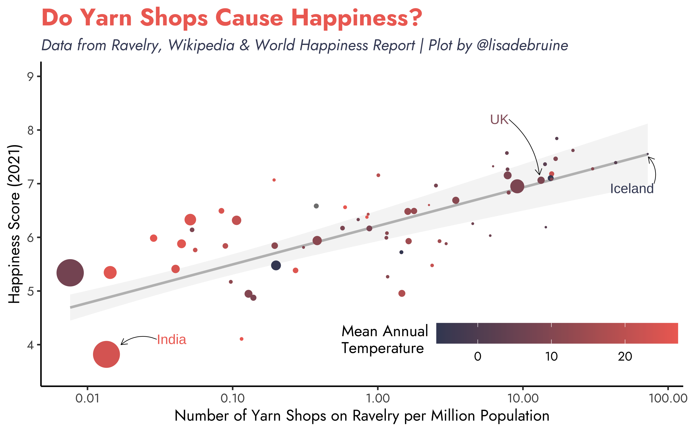

# (PART) Relationships {-}


# Correlation

I'm a sucker for a silly correlation, and I've also been meaning to try out the `r pkg("ravelRy", "https://www.kaylinpavlik.com/introducing-new-r-package-ravelry/")` package for working with the [ravelry API](https://www.ravelry.com/groups/ravelry-api).

```{r, message=FALSE}
library(tidyverse) # for data wrangling
library(ravelRy)   # for searching ravelry 
library(rvest)     # for web scraping
library(DT)        # for interactive table
library(showtext)  # for fonts

# add the font Ravelry uses on their webpage
font_add_google(name = "Jost", family = "Jost")
showtext_auto()

# increase penalty for scientific notation
options(scipen = 4)
```

## Craft Shops

I wanted to find the country of all the users on Ravelry, but the `r pkg("ravelRy")` package doesn't have a function for searching people and I don't have time to write one today, so I just searched for yarn shops, which also have a country attribute.

The `slowly()` function below is from `r pkg("purrr")` and retrieves 1000 yarn shops' details every 10 seconds. There turned out to be 8072. You get an error if you try to retrieve an empty page of shops, so I wrapped the `search_shops()` code in `tryCatch()` so the function didn't fail then. I saved the result to RDS so I can set this code chunk to `eval = FALSE` and read this in without calling the ravelry API every time I knit this book.

```{r, eval = FALSE}
slow_shop <- slowly(function(page) { 
    tryCatch({
      shops <- search_shops(page_size = 1000, page = page) 
      shops$country.name
    }, error = function(e) {})
}, rate = rate_delay(10))

shops <- map(1:10, slow_shop) %>% unlist()
saveRDS(shops, "data/yarn_shops.rds")
```

I had to fix some country names so they match with the other data sets. There is only one happiness value for the UK, so I reluctantly combined the four countries in the UK.

```{r}
shops <- readRDS("data/yarn_shops.rds")

shop_countries <- tibble(
  country = shops
) %>%
  mutate(country = recode(country,
                          Wales = "United Kingdom", 
                          Scotland = "United Kingdom",
                          England = "United Kingdom",
                          "Northern Ireland" = "United Kingdom",
                          "Viet Nam" = "Vietnam",
                          "Bosnia and Herzegowina" = "Bosnia and Herzegovina",
                          "Korea, Republic of" = "South Korea",
                          .default = country)) %>%
  count(country, name = "yarn_shops")
```

## Temperature

I feel like average temperature might have something to do with the number of yarn shops in a country, so I scraped that from a Wikipedia page using `r pkg("rvest")`. I had to edit the Wikipedia page first because the table formatting was borked. I also had to fix the html minus symbol because it made the negative numbers read in as character strings.

```{r}
temp <- read_html("https://en.wikipedia.org/wiki/List_of_countries_by_average_yearly_temperature") %>%
  html_nodes('table.wikitable') %>%
  html_table(header = TRUE) %>%
  bind_rows() %>%
  as_tibble() %>%
  rename(country = 1, temp = 2) %>%
  mutate(temp = gsub("−", "-", temp)) %>%
  type_convert(col_types = "cd")

head(temp)
```

Then I decided maybe the average temperature for the coldest month was better, which I found on a site with the rather upsetting name [listfist](https://listfist.com/list-of-countries-by-average-temperature), but had problems reading it with rvest so gave up.

```{r, error = TRUE}
html <- read_html("https://listfist.com/list-of-countries-by-average-temperature")
```


## Happiness

I got the happiness ratings from the [World Happiness Report](https://worldpopulationreview.com/country-rankings/happiest-countries-in-the-world), which also included a population column in units of thousands.

```{r}
happy <- read_csv("data/happiness_2022.csv",
                  show_col_types = FALSE) %>%
  mutate(pop2022 = pop2022 * 1000)
```


## Join Data

Now to join all the data together.

```{r}
happy_craft <- shop_countries %>%
  left_join(happy, by = "country") %>%
  filter(!is.na(pop2022)) %>%
  left_join(temp, by = "country") %>%
  mutate(shops_per_M = 1e6 * yarn_shops / pop2022)
```

In case you want to find your country in the data.

```{r, results='asis'}
happy_craft %>%
  mutate(shops_per_M = round(shops_per_M, 3)) %>%
  select("Country" = country, 
         "Yarn Shops" = yarn_shops, 
         "Shops/M" = shops_per_M,
         Happiness = happiness2021, 
         Population = pop2022, 
         "Mean Temp" = temp) %>%
  DT::datatable()
```

## Correlations

Let's just have a quick look at the correlations here. The number of yarn shops per million population is positively correlated with happiness and negatively correlated with mean annual temperature. However, temperature is also negatively correlated with happiness.

```{r}
happy_craft %>%
  select(shops_per_M, happiness2021, temp) %>%
  cor(use = "pairwise.complete.obs") %>%
  round(2)
```


## Initial Plot

First, I made a simple plot of the correlation between the number of yarn shops per million people and happiness score for each country. I set the size of the points relative to the population and the colour relative to the mean annual temperature.

```{r corr-plot}
ggplot(happy_craft, aes(x = shops_per_M, 
                        y = happiness2021, 
                        size = pop2022,
                        color = temp)) +
  geom_point()
```

## Customise the plot

```{r, include = FALSE}
iceland <- filter(happy_craft, country == "Iceland")$shops_per_M %>%
  round(1)
```


Iceland is the outlier, with `r iceland` yarn shops on Ravelry, so I'll set the x-axis to log10. I'll also use some annotations tricks I learned 
for Day\ \@ref(the-economist).

```{r corr-day13}
ggplot(happy_craft, aes(x = shops_per_M, 
                        y = happiness2021, 
                        size = pop2022,
                        color = temp)) +
  geom_smooth(mapping = aes(weight = pop2022),
              method = lm, formula = y~x, 
              color = "grey", alpha = 0.1,
              show.legend = FALSE) +
  geom_point() +
  
  # label a few countries
  annotate("text", label = "Iceland", color = "#404763", 
           hjust = 1, vjust = 1,
           x = 80, y = 7, size = 4) +
  annotate(geom = "curve", curvature = 0.3, size = 0.25,
            x = 80, y = 7, 
            xend = 73, yend = 7.5,
            arrow = arrow(length = unit(0.4, "lines"))) +
  annotate("text", label = "India", color = "#EF6E62", 
           hjust = 0, vjust = 0.5,
           x = .03, y = 4.1, size = 4) +
  annotate(geom = "curve", curvature = 0.3, size = 0.25,
            x = .03, y = 4.1, 
            xend = .017, yend = 4,
            arrow = arrow(length = unit(0.4, "lines"))) +
  annotate("text", label = "UK", color = "#94616C", 
           hjust = 1, vjust = 0.5,
           x = 8, y = 8.2, size = 4) +
  annotate(geom = "curve", curvature = -0.2, size = 0.25,
            x = 8, y = 8.2, 
            xend = 13, yend = 7.164,
            arrow = arrow(length = unit(0.4, "lines"))) +
  
  # scale functions
  scale_size_area("Population",
                  max_size = 10,
                  breaks = 10^(5:9),
                  labels = c("100K", "1M", "10M", "100M", "1B")) +
  scale_color_gradient("Mean Annual\nTemperature\n",
                       low = "#404763", high = "#EF6E62") +
  scale_y_continuous("Happiness Score (2021)",
                     limits = c(3.5, 9)) +
  scale_x_log10("Number of Yarn Shops on Ravelry per Million Population") +
  guides(size = "none") +
  labs(title = "Do Yarn Shops Cause Happiness?",
       subtitle = "Data from Ravelry, Wikipedia & World Happiness Report | Plot by @lisadebruine") +
  theme_classic(base_family = "Jost", base_size = 13) +
  theme(
    plot.title = element_text(face = "bold", color = "#EF6E62", size = 20),
    plot.subtitle = element_text(face = "italic", color = "#404763"),
    legend.position = c(.73, .12),
    legend.key.width = unit(.07, "npc"),
    legend.direction = "horizontal",
    legend.background = element_blank()
  )
```

```{r, include = FALSE, eval = FALSE}
ggsave("images/day13.png", width = 8, height = 5, device = png)

```


# 3-dimensional

I love 3D and wish I had more time to work on the [webmorph](https://webmorph.org) 3D functions (I made the following gif using it).

```{r spin, echo = FALSE}

```

But those are made with three.js and I was excited to play with `r pkg("rgl")` a bit.

```{r}
library(rgl)
source("R/readOBJ.R")
```

## Load OBJ

Load the 3D data from an OBJ file using `rgl::readOBJ()`. If you get the error "Error in order(vlinks[[i]][, 2]) : argument 1 is not a vector", this means a vertex was empty, which the function doesn't seem to be able to handle. I hacked the `readOBJ()` function a bit and fixed it, so check my github for this if you have the same problem.

```{r}
obj <- "data/lisa_neutral.obj"
skin <- "data/lisa_neutral.png"

objexample <- readOBJ(
  obj,
  material = list(color = "white",
                  texture = skin))
```

Just to give you nightmares, this is what the skin looks like for a 3D face in 2D:

```{r lisa-skin, echo = FALSE}

```


## Render scene

Now clear a scene. You might need to install [XQuartz](https://www.xquartz.org/) if you're on a mac. If you're running this interactively, a small XQuartz window should pop up.

```{r}
clear3d(type = c("shapes", "lights"))
```

Add the face as a wireframe object.

```{r}
wire3d(objexample)
```

You can include this in a webpage with `rglwidget()`.

```{r}
rglwidget(width = 600, height = 800) 
```


## Give Up

I tried to get it to display with the skin, but failed. Then after I rendered the book, I noticed the skin *was* showing in the book, just not in XQuartz while I was testing. But I was really tired at that point so I gave up and tried something else for today's theme.

These objects are pretty big, so remove it when you're done.

```{r}
rm(objexample)
```

## Try Plotly Instead

I know I can do this fast, so I'll make some 3-dimensional data from a multivariate normal distribution using `r pkg("faux")`, and 3D plot it using `r pkg("plotly")`.

```{r}
library(plotly)
library(faux)
library(dplyr)
```

### Simulate multivariate distribution

In faux, you can set the correlations using a matrix, or just the upper right triangle values as a vector. So `c(.1, .2, .3)` would mean that $r_{xy} = .1$, $r_{xz} = .2$, and $r_{yz} = .3$.

```{r}
dat_ppp <- faux::rnorm_multi(
  r = c(.9, .9, .9),
  varnames = c("x", "y", "z")
) %>%
  mutate(cors = "+++")

dat_nnp <- faux::rnorm_multi(
  r = c(-.9, -.9, .9),
  varnames = c("x", "y", "z")
) %>%
  mutate(cors = "--+")

dat_pnn <- faux::rnorm_multi(
  r = c(.9, -.9, -.9),
  varnames = c("x", "y", "z")
) %>%
  mutate(cors = "+--")

dat <- bind_rows(dat_ppp, dat_nnp, dat_pnn)
```

### Marker style

Next, set up the marker style.

```{r}
#set up the marker style
marker_style = list(
    line = list(
      color = "#444", 
      width = 1
    ), 
    opacity = 0.5,
    size = 3
  )
```


### 3D Plot

Finally, make the plot and add markers. These plots look cool, but I find them pretty hard for inference with data.

```{r plotly-3d}
# plot and add markers
plot_ly(data = dat,
        x = ~x, y = ~y, z = ~z, 
        color = ~cors,
        marker = marker_style) %>%
  add_markers()
```

# Multivariate

I wrote `r pkg("faux")` to make it easier to simulate multivariate normal distribution data with different patterns of correlations, because I was doing it manually using `mvrnorm()` so often. It's expanded to a whole package dedicated to making simulation easier, focussing on simulation from the kinds of parameters you might find in the descriptives table of a paper.

I'll be using the new NORTA (NORmal-To-Anything) methods for today's chart, which are currently only in the development version of faux, so you need to download the GitHub version, not 1.1.0 on CRAN. You can see a [tutorial here](https://debruine.github.io/faux/dev/articles/norta.html).

```{r, message=FALSE}
# devtools::install_github("debruine/faux")
# devtools::install_github("debruine/webmorphR")
library(faux)      # for data simulation
library(ggplot2)   # for plotting
library(ggExtra)   # for margin plots
library(patchwork) # for combining plots
library(webmorphR) # for figure making from images

theme_set(theme_minimal(base_size = 14))
```

## Simulate data

The `rmulti()` function uses simulation to determine what correlations among normally distributed variables is equivalent to the specified correlations among non-normally distributed variables, then simulates correlated data from a multivariate normal distribution and converts it to the specified distributions using quantile functions.

It works pretty much like `rnorm_multi()`, with the addition of a `dist` argument where you can set the distribution and a `params` argument where you can set their parameters.

The code below simulates 1000 people with uniformly distributed age between 50 and 70, and the number of texts they send per day, which we'll simulated with a Poisson distribution with a mean (lambda) of 5. They're given a questionnaire with 1-7 Likert ratings, which are averaged, so the resulting scores are truncated from 1 to 7, with a mean of 3.5 and SS of 2.1. Age and texts are negatively correlated with $r =-0.3$. Age is also negatively related to the score, $r = -.4$, while score and texts are positively correlated $r = 0.5$.


```{r}
set.seed(8675309) # for reproducibility

dat <- rmulti(
  n = 1000, 
  dist = c(age = "unif",
           texts = "pois",
           score = "truncnorm"),
  params = list(
    age = c(min = 50, max = 70),
    texts = c(lambda = 5),
    score = c(a = 1, b = 7, mean = 3.5, sd = 2.1)
  ),
  r = c(-0.3, -0.4, +.5)
)

check_sim_stats(dat)
```


## Plot individual distributions

### Age

Age is uniformly distributed from 50 to 70, so a histogram is probably most appropriate here. Why is the default histogram so ugly?

```{r mv-unif1}
ggplot(dat, aes(x = age)) +
  geom_histogram(binwidth = 1)
```

Oops, I forgot that the uniform distribution is continuous and we normally think of age in integers. There are about half as many 50 and 70 year olds than the other ages. You can fix that by simulating age from 50.501 to 70.499 (I can never remember which way exact .5s round, so I just make sure they won't round to 49 or 71.) 

```{r}
set.seed(8675309) # for reproducibility
dat <- rmulti(
  n = 1000, 
  dist = c(age = "unif",
           texts = "pois",
           score = "truncnorm"),
  params = list(
    age = c(min = 50 - .499, max = 70 + .499),
    texts = c(lambda = 5),
    score = c(a = 1, b = 7, mean = 3.5, sd = 2.1)
  ),
  r = c(-0.3, -0.4, +.5)
)

dat$age <- round(dat$age)
```

I'll also fix the histogram style.

```{r mv-unif2}
ggplot(dat, aes(x = age)) +
  geom_histogram(binwidth = 1, fill = "white", color = "black")
```

### Texts - Poisson

The Poisson distribution approaches the normal when lambda gets large, which is why I set the example to a low number of texts.

```{r mv-pois}
ggplot(dat, aes(x = texts)) +
  geom_histogram(binwidth = 1, fill = "white", color = "black")
```

### Score

The truncated normal distribution for our score has a minimum value of 1 and a maximum value of 7.

```{r mv-trunc1}
ggplot(dat, aes(x = score)) +
  geom_histogram(binwidth = 1, fill = "white", color = "black")
```

The default histogram isn't great for this. The first column is scores between 0.5 and 1.5, and half of those are impossible scores. Set the histogram boundary to 1 to and x-axis breaks to 1:7 to fix this. Now each bar is the number of people with scores between the breaks.

```{r mv-trunc}
ggplot(dat, aes(x = score)) +
  geom_histogram(binwidth = 1, boundary = 1, 
                 fill = "white", color = "black") +
  scale_x_continuous(breaks = 1:7)
```

## Plot bivariate distributions

Now that we have a bit of a handle on the data, we can try to plot all the joint distributions. 

First, I'll calculate a few things I'll need in all the plots. I set the limits for age and texts to ±0.5 from the actual range so that the margin histograms display like above, rather than with boundaries at the limits.

```{r}
# axis limits
age_limit <- c(50-0.5, 70 + 0.5)
texts_limit <- c(0-0.5, max(dat$texts) + 0.5)
score_limit <- c(1, 7)

# custom colours
age_col <- "#D7A9E3"
score_col <- "#8BBEE8"
texts_col <- "#A8D5BA"

# plot titles
titles <- c(
  age_texts = cor(dat$age, dat$texts),
  score_age = cor(dat$age, dat$score),
  texts_score = cor(dat$texts, dat$score)
) %>%
  round(2) %>%
  list("r = %.2f", .) %>%
  do.call(sprintf, .) %>%
  paste0(c("Age vs Texts", "Score vs Age", "Texts vs Score"), " (", ., ")")
```

### Age vs Texts

```{r age-vs-texts}
ggplot(dat, aes(age, texts)) +
  geom_point() +
  geom_smooth(method = lm, formula = y~x)
```

These are both integer values, so there is a lot of overplotting with 1000 subjects. There are a few ways to deal with this. Let's compare them.

```{r overplot, fig.width = 12, fig.height =8}

overplot_jitter <- ggplot(dat, aes(age, texts)) +
  geom_jitter(width = .2, height = .2) +
  ggtitle("Use geom_jitter()")

overplot_alpha <- ggplot(dat, aes(age, texts)) +
  geom_point(size = 3, alpha = 0.1) +
  ggtitle("Reduce the point alpha")

overplot_color <- ggplot(dat, aes(age, texts)) +
  geom_count(aes(color = ..n..), size = 3, show.legend = FALSE) +
  scale_color_viridis_c() +
  ggtitle("Use colour")

overplot_count <- ggplot(dat, aes(age, texts)) +
  geom_count(show.legend = FALSE) +
  scale_color_viridis_c() +
  ggtitle("Use geom_count()")

overplot_2dhist <- ggplot(dat, aes(age, texts)) +
  geom_bin2d(binwidth = c(1, 1), show.legend = FALSE) +
  scale_fill_viridis_c() +
  ggtitle("Use geom_bin2d()")

overplot_density <- ggplot(dat, aes(age, texts)) +
  geom_density_2d_filled(show.legend = FALSE) +
  ggtitle("Use geom_density_2d_filled()")

overplot_jitter + overplot_alpha + overplot_color +
  overplot_count +overplot_2dhist + overplot_density +
  plot_layout(nrow = 2)
```


Now I can add the marginal distributions with `r pkg("ggExtra")` and tidy up the plot a bit. I decided to use `geom_count()` first, but then realised that the marginal distribution plots looked wrong because the marginal histograms were counting the number of plotted points per bin, not the number of data points. So I ended up using a combination of `geom_density_2d_filled()` and `geom_point()` with a low alpha. The marginal plots don't work unless you have some version of `geom_point()` (although you could set the alpha to 0 to make it invisible).
 

```{r age-texts, fig.width = 5, fig.height = 5}

p1 <- ggplot(dat, aes(age, texts)) +
  geom_density_2d_filled(alpha = 0.7) +
  scale_fill_grey() +
  geom_point(alpha = 0.1) +
  geom_smooth(method = lm, formula = y~x, 
              color = "black") +
  coord_cartesian(xlim = age_limit, ylim = texts_limit) +
  scale_y_continuous(breaks = seq(0, 20, 2)) +
  labs(x = "Age (in years)",
       y = "Number of texts sent per day",
       title = titles[1]) +
  theme(legend.position = "none")

age_texts <- ggMarginal(p1, type = "histogram", 
                        binwidth = 1, 
                        xparams = list(fill = age_col),
                        yparams = list(fill = texts_col, boundary = 0))

age_texts
```


### Score vs Age


```{r score-age, fig.width = 5, fig.height = 5}

p2 <- ggplot(dat, aes(score, age)) +
  geom_density_2d_filled(alpha = 0.7) +
  scale_fill_grey() +
  geom_point(alpha = 0.1) +
  geom_smooth(method = lm, formula = y~x, 
              color = "black") +
  scale_x_continuous(breaks = 1:7) +
  coord_cartesian(xlim = score_limit, ylim = age_limit) +
  labs(y = "Age (in years)",
       x = "Score on questionnaire",
       title = titles[2]) +
  theme(legend.position = "none")

score_age <- ggMarginal(p2, type = "histogram", 
                        xparams = list(binwidth = 0.5, fill = score_col),
                        yparams = list(binwidth = 1, fill = age_col))

score_age
```

### Texts vs Score


```{r texts-score, fig.width = 5, fig.height = 5}

p3 <- ggplot(dat, aes(texts, score)) +
  geom_density_2d_filled(alpha = 0.7) +
  scale_fill_grey() +
  geom_point(alpha = 0.1) +
  geom_smooth(method = lm, formula = y~x, 
              color = "black") +
  scale_x_continuous(breaks = seq(0, 20, 2)) +
  scale_y_continuous(breaks = 1:7) +
  coord_cartesian(xlim = texts_limit, ylim = score_limit ) +
  labs(x = "Number of texts sent per day",
       y = "Score on questionnaire",
       title = titles[3]) +
  theme(legend.position = "none")

texts_score <- ggMarginal(p3, type = "histogram", 
                        xparams = list(binwidth = 1, fill = texts_col),
                        yparams = list(binwidth = 0.5, fill = score_col))

texts_score
```


## Combine

You can't combine plots with margins made by ggExtra using patchwork, so I have to save each to a file individually and combine them with `r pkg("webmorphR", "https://debruine.github.io/webmorphR/")`. 

```{r}
ggsave("images/mv_1_age_texts.png", age_texts, width = 5, height = 5)
ggsave("images/mv_2_score_age.png", score_age, width = 5, height = 5)
ggsave("images/mv_3_texts_score.png", texts_score, width = 5, height = 5)
```

WebmorphR is an R package I'm developing for making visual stimuli for research in a way that is computationally reproducible. It uses magick under the hood, but has a lot of convenient functions for [making figures](https://debruine.github.io/webmorphR/articles/figures.html).


```{r day15}
# read in images starting with mv_
imgs <- webmorphR::read_stim("images", "^mv_\\d")

# plot in a single row
fig <- plot(imgs, nrow = 1)

fig
```

Save the figure to a file.

```{r day15-save}
write_stim(fig, dir = "images", names = "day15", format = "png")
```


# Environment

# Connections

# OECD
