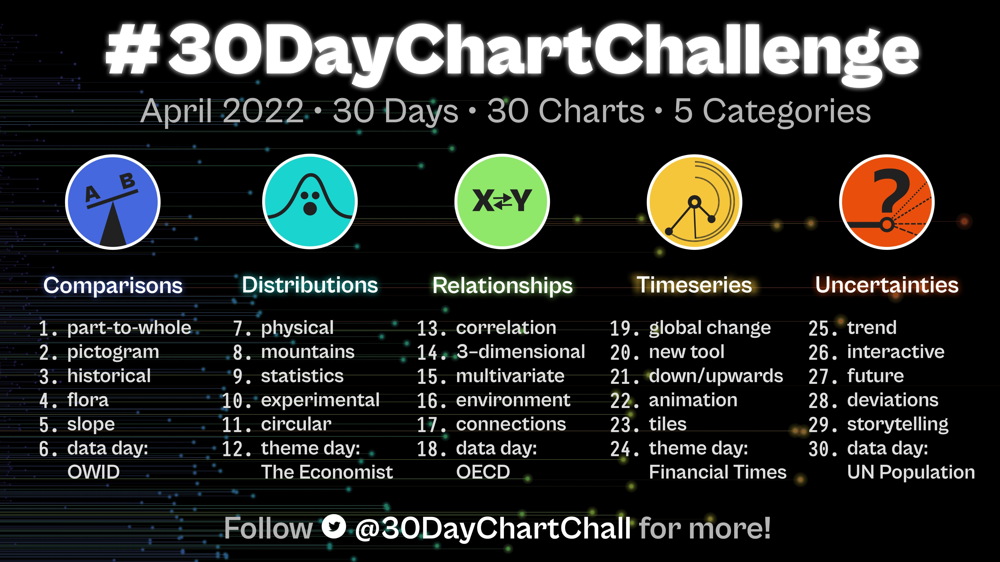

--- 
title: "30-day Chart Challenge"
subtitle: "2022"
author: "Lisa DeBruine"
date: "`r Sys.Date()`"
site: bookdown::bookdown_site
documentclass: book
bibliography: [book.bib, packages.bib]
csl: include/apa.csl
classoption: oneside
geometry: margin=1in
link-citations: yes
description: "2022 30-day chart challenge"
url: https://debruine.github.io/30-day-chart-challenge/
github-repo: debruine/30-day-chart-challenge
cover-image: images/logos/logo.png
apple-touch-icon: images/logos/apple-touch-icon.png
apple-touch-icon-size: 180
favicon: images/logos/favicon.ico
---

```{r cite-packages, include = FALSE}
# automatically create a bib database for R packages
# add any packages you want to cite here
knitr::write_bib(c(
  .packages(), 'bookdown', 'tidyverse'
), 'packages.bib')
```

# Overview {-}

This is my first year participating in the [30-day chart challenge](https://github.com/30DayChartChallenge/Edition2022). In my work with [PsyTeachR](https://psyteachr.github.io), we do almost everything in bookdown, so I thought I'd make a book with our open-source [PsyTeachR template](https://psyteachr.github.io/template/).



I'm going to use data simulation for most of my charts, so this will also end up being a resource for how to simulate different types of data. 

<style>
.daily_imgs a {
    background-repeat: no-repeat;
    background-position: center center;
    background-size: contain;
    width: 31%;
    height: 0;
    display: inline-block;
    margin: 1%;
    padding-bottom: 31%;
    float: left;
}
</style>

```{r day1, eval = FALSE, include = FALSE, results='asis'}
imgpaths <- list.files("images", pattern = "^day\\d{1,2}\\.(png|gif)")
chapters <- c("part-to-whole", "pictogram", "historical", "flora", "slope", "owid", "physical", "mountains")[seq_along(imgpaths)]

glue::glue("<a href='{{chapters}.html' style='background-image: url(\"images/{{imgpaths}\")'></a>",
           .open = "{{") %>%
  paste(collapse = "") %>%
  cat()
```

<div class='daily_imgs'><a href='part-to-whole.html' style='background-image: url("images/day1.png")'></a><a href='pictogram.html' style='background-image: url("images/day2.png")'></a><a href='historical.html' style='background-image: url("images/day3.png")'></a><a href='flora.html' style='background-image: url("images/day4.png")'></a><a href='slope.html' style='background-image: url("images/day5.png")'></a><a href='owid.html' style='background-image: url("images/day6.gif")'></a><a href='physical.html' style='background-image: url("images/day7.png")'></a><a href='mountains.html' style='background-image: url("images/day8.png")'></a></div>

<br style="clear:both;">
